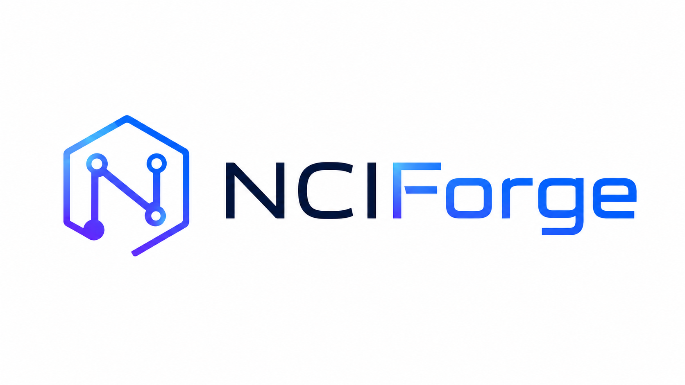

<p align="center">
  
</p>

<p align="center">
  <strong>Interaction informatics for auditable non-covalent-interaction fields, fingerprints, and searchable identities.</strong>
</p>

<p align="center">
  <a href="https://github.com/Prasanna163/NCIForge/releases/tag/nciforge-paper-v1.0.9"></a>
  <a href="https://github.com/Prasanna163/NCIForge/actions/workflows/tests.yml"></a>
  <a href="https://www.python.org/"></a>
  <a href="LICENSE"></a>
  <a href="CITATION.cff"></a>
</p>

## Overview

NCIForge is a scientific-software platform for acquiring, reducing, indexing,
and analysing non-covalent interaction states as structured data. It connects
three complementary representations:

- auditable three-dimensional non-covalent-interaction fields;
- the nine-dimensional Kulkarni--NCI Fingerprint (`f1`--`f9`) with SNCI and
  optional SCDI measurements;
- K-UID and K-UID-Intensive addresses for indexing, comparison, and retrieval.

The field remains the physical source of the analysis. Compact descriptors and
identifiers make interaction states comparable and machine-readable; they do
not replace the underlying electronic-structure or volumetric calculation.

NCIForge 1.0.9 is the frozen software release evaluated in the accompanying
manuscript, *NCIForge: A Hardware-Aware Interaction-Informatics Platform for
Non-Covalent Interaction Fields, Fingerprints, and Searchable Identities*.

## Scientific workflow

```text
molecular structure
    -> conversion and fragment assignment
    -> GeoInit warm start (or legacy UFF)
    -> GFN-xTB optimisation or strict single point
    -> Torch or Multiwfn NCI field
    -> KNF + SNCI + optional SCDI
    -> K-UID indexing, batch tables, and atlas exports
```

Key protocol guarantees in version 1.0.9:

- `--sp` preserves supplied Cartesian coordinates and skips contact seeding,
  pre-optimisation, and geometry optimisation.
- Contact seeding is explicit through `--seed-contact`.
- Production `f3` uses parsed interfragment xTB Wiberg bond order; the older
  identity-overlap estimate is labelled experimental and cannot be silently
  mixed into one K-UID calibration.
- Missing COSMO information remains unavailable (`null`/`n/a`) rather than
  being converted into a physical zero.
- CPU preparation and the serialized GPU field lane are separated, while a
  shared device lock prevents GPU-routed xTB and Torch NCI from contending for
  the same device.

## Requirements

- Python 3.10, 3.11, or 3.12
- Open Babel (`obabel`) for general structure conversion
- xTB for the stock CPU route
- PyTorch for the native Torch NCI backend (CPU or CUDA)
- Multiwfn only when `--nci-backend multiwfn` is selected

The packaged `xtbx` command includes a compact Windows CPU runtime. Explicit
GPU xTB execution requires a compatible CUDA-enabled runtime discovered from
configuration, environment variables, or standard installation locations.

## Installation

Clone the repository and install from source:

```bash
git clone https://github.com/Prasanna163/NCIForge.git
cd NCIForge
python -m venv .venv
```

Windows PowerShell:

```powershell
.\.venv\Scripts\Activate.ps1
python -m pip install --upgrade pip
python -m pip install -e ".[api,torch-nci,plots]"
```

macOS or Linux:

```bash
source .venv/bin/activate
python -m pip install --upgrade pip
python -m pip install -e ".[api,torch-nci,plots]"
```

Interactive installation helpers are also provided:

```powershell
.\scripts\install_nciforge.ps1
```

```bash
bash scripts/install_nciforge.sh
```

## Quick start

Run one structure with the production defaults (GeoInit, xTBX, Torch NCI):

```bash
nciforge example.mol --force
```

Preserve externally supplied coordinates exactly:

```bash
nciforge complex.xyz --sp --force
```

Process a directory:

```bash
nciforge molecules --processing multi --workers 4 --force
```

Use Torch CUDA with automatic per-molecule CPU fallback after exhausted CUDA
memory retries:

```bash
nciforge molecules --gpu --processing multi
```

Force the CPU path:

```bash
nciforge molecules --cpu
```

Use the Multiwfn reference backend:

```bash
nciforge complex.xyz --nci-backend multiwfn
```

Display the complete command surface:

```bash
nciforge --help
nciforge --version
geoinit --help
xtbx --help
```

The historical `knf` console command remains an alias of `nciforge`.

## Principal outputs

Each successful structure produces `knf.json` and `output.txt`. The JSON record
contains the descriptor vector, SNCI/SCDI fields, protocol metadata, fragment
information, backend/device details, and K-UID material where available.

Batch workflows produce:

- `batch_knf.json`
- `batch_knf_unified.csv`
- K-UID calibration, prefix, bridge, reverse-index, and family-statistics files
- water-suffixed variants for hydration workflows
- `submission_bundle/atlas_submission.csv` and `manifest.json` with
  `--atlas-bundle`

Undefined scientific quantities remain explicit. Consumers should inspect the
associated availability, definition, quality, and protocol fields before
comparing records or fitting models.

## API

Install the API extra and start the service:

```bash
nciforge-api --host 127.0.0.1 --port 8000
```

Primary endpoints:

- `GET /health`
- `GET /jobs`
- `POST /jobs/path`
- `POST /jobs/upload`
- `GET /jobs/{job_id}`
- `GET /jobs/{job_id}/download/{artifact_name}`

Interactive OpenAPI documentation is available at
`http://127.0.0.1:8000/docs` while the service is running.

## Docker

Build and run the CPU reference container:

```bash
docker build -t nciforge:1.0.9 .
docker run --rm -v "$(pwd):/work" -w /work nciforge:1.0.9 \
  example.mol --force --xtb-engine xtb
```

See [README.DOCKER.md](README.DOCKER.md) for batch, API, Compose, and
PowerShell examples.

## Validation and reproducibility

The frozen paper release is
[`nciforge-paper-v1.0.9`](https://github.com/Prasanna163/NCIForge/releases/tag/nciforge-paper-v1.0.9)
at commit `afa3f76a07b799eaa832d41633f28ce5b7224ae4`. The release includes source,
validation data, manuscript and Supporting Information PDFs, and a SHA-256
manifest.

Repository checks:

```bash
python -m pytest tests -q
python -m compileall -q knf_core geoinit nciforge_xtbx nciforge_cli.py
python -m build
python -m twine check dist/*
```

Real xTB integration tests are opt-in:

```powershell
$env:KNF_RUN_XTB_TESTS = "1"
python -m pytest tests/test_engine_regression.py -q
```

The frozen scientific suite contains 87 normally enabled tests; the publication
branch adds three metadata checks, giving 90 enabled tests in the current tree.
Three further live-xTB tests are opt-in. Benchmark and comparison artifacts
retained in `nci_compare/` and `test-4/` are provenance-bearing validation
material, not package runtime data.

## Documentation

- [Detailed NCI modes](documentation/NCIFORGE_NCI_MODES_DETAILED.md)
- [NCI analysis reference](documentation/NCIFORGE_NCI_ANALYSIS_REFERENCE.md)
- [Docker guide](README.DOCKER.md)
- [Release procedure](RELEASE.md)
- [Changelog](CHANGELOG.md)
- [Citation metadata](CITATION.cff)
- [Contributing](CONTRIBUTING.md)
- [Security policy](SECURITY.md)
- [Third-party notices](THIRD_PARTY_NOTICES.md)

## Scope and limitations

NCIForge standardizes and records an interaction-analysis workflow; it does not
make the underlying approximate electronic-structure method exact. Results can
depend on geometry preparation, charge and multiplicity, fragment definition,
xTB method, NCI backend, grid spacing and padding, numerical precision, and the
calibration population. K-UID values are versioned addresses, not universal
chemical invariants. Performance comparisons should be interpreted only for
the stated hardware, workload, and protocol.

## Citation

If you use NCIForge, cite the software release and accompanying article. GitHub
can export the repository citation directly from [CITATION.cff](CITATION.cff).
The archival DOI should be added to that file and this section once the public
record is issued.

## Authors

- Prasanna P. Kulkarni — Institute of Chemical Technology Mumbai, Marathwada Campus
- Uttkarsh Tiwari — National Institute of Technology Mizoram
- Sravya Isukapatla — Pondicherry University
- Ansh Bajaj — National Institute of Technology Goa

Author identities and the preferred article citation are recorded in
[CITATION.cff](CITATION.cff).

## License

NCIForge is distributed under the [MIT License](LICENSE). External programs and
bundled runtime components remain subject to their respective licenses.
