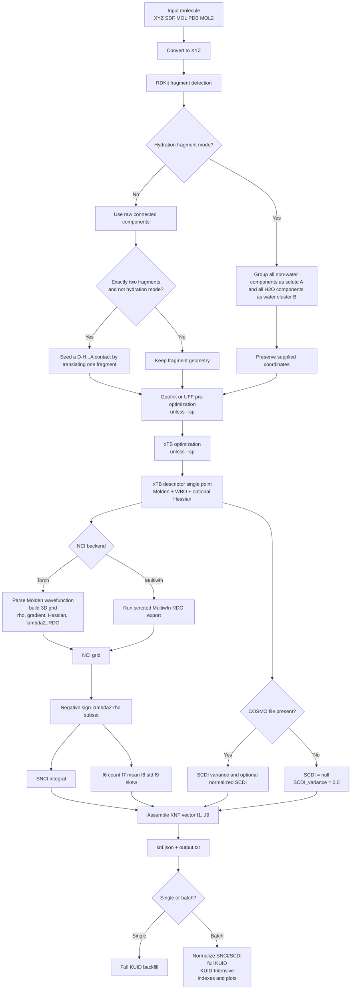
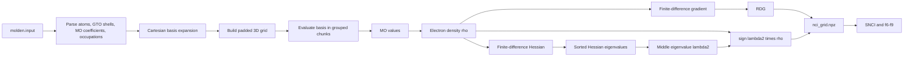
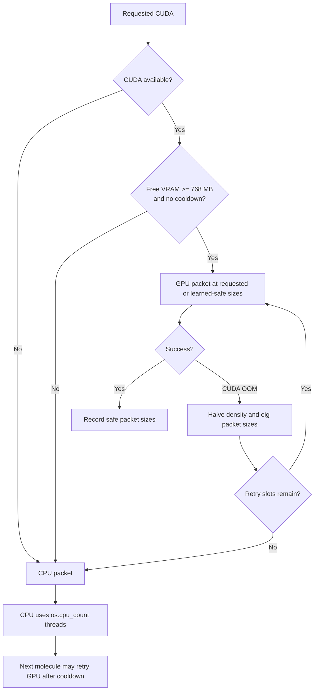
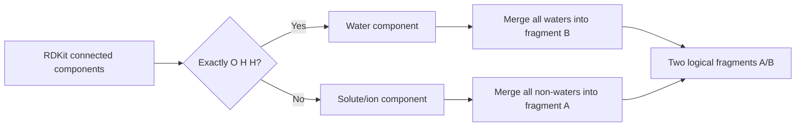

# NCIForge NCI Analysis Reference

> **Current-build audit:** NCIForge package `1.0.9`, CLI milestone `v1`, branch
> `pre-main-testing`, commit `9dccfa8` (`Merge pull request #1 from
> Prasanna163/fix/streaming-xtb-success`), audited on 2026-07-24.
>
> This document describes what the checked-out build actually executes. It is
> source-grounded in `knf_core/`, the live CLI help, tests, and current output
> schemas. It does not silently include work from other local branches.

## Contents

1. [Scope and terminology](#1-scope-and-terminology)
2. [Complete technique inventory](#2-complete-technique-inventory)
3. [End-to-end analysis flow](#3-end-to-end-analysis-flow)
4. [Technique A: Torch wavefunction-based volumetric NCI](#4-technique-a-torch-wavefunction-based-volumetric-nci)
5. [Technique B: Multiwfn RDG/NCI backend](#5-technique-b-multiwfn-rdgnci-backend)
6. [Technique C: SNCI attractive-density integral](#6-technique-c-snci-attractive-density-integral)
7. [Technique D: NCI statistical descriptors \(f_6\)-\(f_9\)](#7-technique-d-nci-statistical-descriptors-f_6-f_9)
8. [Technique E: SCDI surface-charge dispersion](#8-technique-e-scdi-surface-charge-dispersion)
9. [Technique F: the full 9D KNF descriptor](#9-technique-f-the-full-9d-knf-descriptor)
10. [Technique G: normalized SNCI-SCDI quadrant analysis](#10-technique-g-normalized-snci-scdi-quadrant-analysis)
11. [Technique H: KUID instance addressing](#11-technique-h-kuid-instance-addressing)
12. [Technique I: KUID-Intensive topology passports](#12-technique-i-kuid-intensive-topology-passports)
13. [Technique J: KUID indexes, families, bridges, and distributions](#13-technique-j-kuid-indexes-families-bridges-and-distributions)
14. [Technique K: water-mode delta analysis](#14-technique-k-water-mode-delta-analysis)
15. [Technique L: hydration fragment analysis](#15-technique-l-hydration-fragment-analysis)
16. [Technique M: atlas bundle generation](#16-technique-m-atlas-bundle-generation)
17. [Every NCI-facing CLI option](#17-every-nci-facing-cli-option)
18. [Execution, aggregation, and reuse options](#18-execution-aggregation-and-reuse-options)
19. [Option precedence and invalid combinations](#19-option-precedence-and-invalid-combinations)
20. [HTTP API surface](#20-http-api-surface)
21. [Inputs, dependencies, and intermediate data](#21-inputs-dependencies-and-intermediate-data)
22. [Complete output-artifact reference](#22-complete-output-artifact-reference)
23. [Caching, cleanup, and reproducibility](#23-caching-cleanup-and-reproducibility)
24. [Scientific interpretation and hard limitations](#24-scientific-interpretation-and-hard-limitations)
25. [What is not available in this build](#25-what-is-not-available-in-this-build)
26. [Recommended command recipes](#26-recommended-command-recipes)
27. [Failure modes and diagnostics](#27-failure-modes-and-diagnostics)
28. [Implementation source map](#28-implementation-source-map)

---

## 1. Scope and terminology

In this build, “NCI analysis” spans three different layers that should not be
conflated:

1. **Field generation:** evaluate electron density \(\rho(\mathbf r)\), its
   gradient, its Hessian, the reduced density gradient (RDG), and
   \(\operatorname{sign}(\lambda_2)\rho\) on a 3D grid.
2. **Descriptor reduction:** reduce the grid to SNCI and the four NCI-derived
   KNF coordinates \(f_6,f_7,f_8,f_9\); optionally derive SCDI from an xTB COSMO
   surface file.
3. **Dataset-level analysis:** normalize SNCI/SCDI, classify quadrants, encode
   KNF vectors as KUID/KUID-Intensive, build lookup indexes, calculate water
   deltas, and export an atlas bundle.

The current pipeline always records:

```text
nci_spatial_mode = "volumetric_3d"
```

There is no selectable 1D, radial, pair-masked, interface-only, or
promolecular-spatial mode in this branch.

### Status labels used below

| Label | Meaning |
|---|---|
| **Implemented** | Called by the normal current pipeline and backed by current source. |
| **Selectable** | Exposed as a CLI/API choice. |
| **Automatic** | Produced without its own enable flag when prerequisites exist. |
| **Conditional** | Code exists, but an input or dependency must be present. |
| **Post-processing only** | Reuses existing results; it does not regenerate the NCI field. |
| **Present but currently unreachable in fresh standard runs** | The implementation exists, but the normal current producer does not create its required input. |
| **Not available** | No implementation or selectable path exists in this checked-out build. |

---

## 2. Complete technique inventory

| # | Technique | Status in this build | Primary input | Principal output |
|---:|---|---|---|---|
| A | Torch wavefunction-based 3D NCI | **Implemented, default, selectable CPU/CUDA; labeled experimental in stage output** | `molden.input` | `nci_grid.npz`; optional `nci_grid.txt` |
| B | Multiwfn RDG/NCI | **Implemented, selectable CPU backend** | `molden.input`, Multiwfn executable | `nci_grid.txt` |
| C | SNCI attractive-density integration | **Automatic** after either backend | NCI grid | `SNCI` in `knf.json` |
| D | Attractive-grid statistics \(f_6\)-\(f_9\) | **Automatic** after either backend | NCI grid | Four entries in `KNF_vector` |
| E | SCDI/COSMO surface-charge analysis | **Implemented but currently unreachable in fresh standard runs** | xTB `.cosmo` file | `SCDI`, `SCDI_variance` |
| F | 9D KNF descriptor | **Automatic** | geometry, WBO, xTB properties, NCI grid | `KNF_vector` |
| G | SNCI-SCDI normalization and quadrant map | **Automatic for batch aggregation**; plot can be interactive | Successful batch records | normalized columns, JSON, PNG |
| H | Full KUID instance address | **Automatic for single and batch** | \(f_1,\ldots,f_9\) | 9-byte/18-hex KUID |
| I | KUID-Intensive topology passport | **Automatic for batch aggregation** | \(f_3,f_4,f_7,f_8,f_9\) | 5-hex passport |
| J | KUID family/index/reverse-index/bridge analysis | **Automatic for batch aggregation** | KUID-bearing rows | JSON, CSV, optional PNG |
| K | Water-minus-reference delta analysis | **Automatic with `--water`** if reference exists | water and non-water KNF results | delta JSON/TXT |
| L | Hydration A/B fragment grouping | **Selectable** | explicit solute plus H\(_2\)O fragments | altered fragment semantics for \(f_1,f_2,f_3\) |
| M | Canonical atlas bundle | **Selectable export/post-processing** | current or existing KNF outputs | `atlas_submission.csv`, `manifest.json` |
| — | gKNF generalized/pair-resolved NCI | **Not in the current branch** | — | — |
| — | IRI, IGM, DORI, ELF/LOL, QTAIM, SAPT, EDA | **Not implemented as NCIForge techniques** | — | — |

### The most important distinction

The two field backends produce the same conceptual columns:

$$
\left(x,\ y,\ z,\ \operatorname{sign}(\lambda_2)\rho,\ \mathrm{RDG}\right),
$$

but NCIForge’s downstream reducers currently use only
\(\operatorname{sign}(\lambda_2)\rho\). RDG is written to the grid artifact but
is **not used as a threshold or mask** for SNCI or \(f_6\)-\(f_9\).

---

## 3. End-to-end analysis flow



### Geometry behavior that affects all later NCI results

For a two-fragment, non-hydration input, NCIForge can create a favorable
hydrogen-bond contact **only when `--seed-contact` is supplied**. It chooses the
shortest donor-H/acceptor candidate and translates the acceptor-containing
fragment so that:

$$
r_{\mathrm{H\cdots A,target}} = 1.95\ \text{\AA}
$$

along the D-H extension.

`--sp` is strict: it disables contact seeding even if `--seed-contact` is also
present, skips GeoInit/UFF and xTB geometry optimization, and sends the supplied
coordinates to the descriptor single point. Hydration mode also preserves the
supplied coordinates.

---

## 4. Technique A: Torch wavefunction-based volumetric NCI

### 4.1 Purpose

The Torch backend is NCIForge’s default field generator. It evaluates a
Molden-format molecular wavefunction on a rectilinear 3D grid, calculates the
electron-density derivatives numerically, diagonalizes the density Hessian, and
exports RDG plus \(\operatorname{sign}(\lambda_2)\rho\).

It can run on:

- CPU: `--cpu` or `--nci-device cpu`
- CUDA: `--gpu` or `--nci-device cuda`

### 4.2 Required input

xTB must produce `molden.input` with:

- `[Atoms]`
- `[GTO]`
- `[MO]`

The parser reads:

- atomic symbols and coordinates;
- contracted GTO shells \(s,p,d,f,g\);
- primitive exponents and contraction coefficients;
- MO coefficient columns;
- MO occupation numbers.

Coordinates are converted from ångström to bohr when the Molden header contains
`[Atoms] Angs`. The constant is:

$$
1\ \text{\AA} = 1.8897259886\ a_0.
$$

### 4.3 Cartesian Gaussian basis evaluation

For basis function \(\mu\), centered at
\(\mathbf A_\mu=(A_x,A_y,A_z)\), with Cartesian powers
\((l_x,l_y,l_z)\), NCIForge evaluates:

$$
\chi_\mu(\mathbf r)
=
(x-A_x)^{l_x}\,
(y-A_y)^{l_y}\,
(z-A_z)^{l_z}\,
\sum_p d_{\mu p}
\exp\!\left[-\alpha_{\mu p}\lVert\mathbf r-\mathbf A_\mu\rVert^2\right].
$$

The implementation groups basis functions by the power triple
\((l_x,l_y,l_z)\) and evaluates the group in one batched tensor operation. This
changes execution efficiency, not the formula.

Supported shell expansion is Cartesian:

| Shell | Angular momentum \(l\) | Cartesian functions |
|---|---:|---:|
| \(s\) | 0 | 1 |
| \(p\) | 1 | 3 |
| \(d\) | 2 | 6 |
| \(f\) | 3 | 10 |
| \(g\) | 4 | 15 |

If the MO basis size matches a spherical expansion rather than the Cartesian
expansion, the current parser raises `NotImplementedError`. Spherical
\(d/f/g\) support is therefore not available.

### 4.4 Optional primitive normalization

By default, `--nci-apply-primitive-norm` is **off** and Molden contraction
coefficients are used as parsed.

When enabled, every primitive coefficient is multiplied by the Cartesian
primitive normalization:

$$
N(\alpha,l_x,l_y,l_z)
=
\left(\frac{2\alpha}{\pi}\right)^{3/4}
\frac{(4\alpha)^{(l_x+l_y+l_z)/2}}
{\sqrt{(2l_x-1)!!(2l_y-1)!!(2l_z-1)!!}}.
$$

This flag changes the evaluated wavefunction and therefore changes every
downstream NCI field and descriptor. It is not merely a performance setting.

### 4.5 MO and electron-density evaluation

Molecular orbital \(i\) is:

$$
\psi_i(\mathbf r)=\sum_\mu C_{\mu i}\chi_\mu(\mathbf r).
$$

The density used by the Torch backend is:

$$
\rho(\mathbf r)
=
\sum_i n_i\,\psi_i(\mathbf r)^2,
$$

where \(n_i\) is the occupation parsed from Molden. NaN and negative density
values are replaced/clamped to nonnegative values.

Grid points are evaluated in packets controlled by `--nci-batch-size`; that
option is a memory/performance parameter and does not intentionally alter the
mathematical result.

### 4.6 Grid construction

For each Cartesian axis \(\alpha\in\{x,y,z\}\), let the minimum and maximum
atomic coordinates in bohr be \(R_{\alpha,\min}\) and
\(R_{\alpha,\max}\). With padding \(p\) and spacing \(h\), the grid covers:

$$
\alpha_{\min}=R_{\alpha,\min}-p,\qquad
\alpha_{\max}=R_{\alpha,\max}+p,
$$

with:

$$
\alpha_i=\alpha_{\min}+i h.
$$

The CLI values are supplied in ångström and converted to bohr. Defaults:

$$
h=0.2\ \text{\AA},\qquad p=3.0\ \text{\AA}.
$$

The total point count is:

$$
N_\mathrm{grid}=N_xN_yN_z.
$$

Halving the spacing can increase the point count by approximately \(2^3=8\)
for a fixed box. Padding also grows all three dimensions.

### 4.7 Numerical density derivatives

For interior points, first derivatives use centered differences:

$$
\frac{\partial\rho}{\partial x}
\approx
\frac{\rho(x+h,y,z)-\rho(x-h,y,z)}{2h}.
$$

At the first and last planes, first derivatives use one-sided differences.

Pure second derivatives use:

$$
\frac{\partial^2\rho}{\partial x^2}
\approx
\frac{\rho(x+h,y,z)-2\rho(x,y,z)+\rho(x-h,y,z)}{h^2}.
$$

Boundary pure-second-derivative values are copied from the adjacent interior
plane.

Mixed derivatives use:

$$
\frac{\partial^2\rho}{\partial x\,\partial y}
\approx
\frac{
\rho(x+h,y+h)-\rho(x+h,y-h)-\rho(x-h,y+h)+\rho(x-h,y-h)
}{4h^2}.
$$

Mixed derivatives are set to zero on the relevant grid boundaries.

These derivatives form the symmetric Hessian:

$$
\mathbf H_\rho(\mathbf r)=
\begin{bmatrix}
\rho_{xx} & \rho_{xy} & \rho_{xz}\\
\rho_{xy} & \rho_{yy} & \rho_{yz}\\
\rho_{xz} & \rho_{yz} & \rho_{zz}
\end{bmatrix}.
$$

### 4.8 Hessian eigenvalue and interaction sign

At every grid point, the Hessian eigenvalues are sorted:

$$
\lambda_1\le\lambda_2\le\lambda_3.
$$

NCIForge retains the middle eigenvalue \(\lambda_2\), then calculates:

$$
s_{\lambda_2\rho}(\mathbf r)
=
\operatorname{sign}\!\left(\lambda_2(\mathbf r)\right)\rho(\mathbf r).
$$

Interpretive sign convention:

| \(s_{\lambda_2\rho}\) | Density-Hessian sign | Conventional interpretation |
|---:|---|---|
| \(<0\) | \(\lambda_2<0\) | attractive-like region |
| \(\approx 0\) | weak/low-density | weak or vanishing region |
| \(>0\) | \(\lambda_2>0\) | repulsive/steric-like region |

The eigenvalue calculation is packeted by `--nci-eig-batch-size`. If CUDA
batched diagonalization fails for a pathological slice, that slice is moved to
CPU for `eigvalsh` and then copied back to the CUDA device.

### 4.9 Reduced density gradient

The reduced density gradient is:

$$
\mathrm{RDG}(\mathbf r)
=
\frac{1}{2(3\pi^2)^{1/3}}
\frac{\lVert\nabla\rho(\mathbf r)\rVert}
{\rho(\mathbf r)^{4/3}}.
$$

The implementation uses:

$$
\rho_\mathrm{safe}=\max(|\rho|,\rho_\mathrm{floor}).
$$

If \(|\rho|<\rho_\mathrm{floor}\), RDG is set to zero rather than allowing the
denominator to diverge. The default is:

$$
\rho_\mathrm{floor}=10^{-12}.
$$

**Critical current behavior:** RDG is exported, but the downstream SNCI and
\(f_6\)-\(f_9\) calculations do not filter on RDG.

### 4.10 Torch flowchart



### 4.11 Device routing and CUDA OOM recovery

`--gpu` maps to Torch/CUDA/float32 and activates the adaptive packet plan.

Default router constants:

| Router parameter | Current value |
|---|---:|
| Minimum free VRAM before trying GPU | 768 MB |
| GPU retry cooldown | 2 later jobs initially |
| Maximum GPU packet attempts per molecule | 3 |
| Minimum density packet size | 20,000 |
| Minimum eigenvalue packet size | 15,000 |

The packet sequence is:



The router remembers successful GPU packet sizes and OOM history across
molecules in the same Python process.

GPU NCI execution is serialized against any concurrent `xtbx --gpu` subprocess
with a shared device lock. CPU NCI does not wait for that lock.

### 4.12 Torch outputs

`nci_grid.npz` contains:

| Key | Meaning |
|---|---|
| `x`, `y`, `z` | Grid axes |
| `sign_lambda2_rho` | 3D \(s_{\lambda_2\rho}\) field |
| `rdg` | 3D RDG field |
| `output_units` | One-element array, normally `"bohr"` |

It does **not** retain:

- raw \(\rho\);
- raw \(\lambda_2\);
- the gradient components;
- the Hessian;
- fragment or atom ownership masks.

With `--full-files`, Torch also writes `nci_grid.txt`:

```text
x y z sign(lambda2)*rho RDG
```

Without `--full-files`, the text grid is not created and the NPZ is deleted
after descriptor reduction.

---

## 5. Technique B: Multiwfn RDG/NCI backend

### 5.1 Selection

Equivalent selection forms:

```bash
nciforge molecule.mol --multiwfn
```

```bash
nciforge molecule.mol --nci-backend multiwfn
```

Both force the NCI device to CPU. Multiwfn must be available as `Multiwfn` or
`Multiwfn.exe`, either in `PATH`, through `--multiwfn-path`, or through the
saved NCIForge tool configuration.

### 5.2 Exact automation sequence

NCIForge writes `multiwfn.inp` containing:

```text
20
1
3
1
2
0
0
q
```

It then executes:

```text
Multiwfn <absolute-or-resolved-molden-path>
```

with:

- `multiwfn.inp` connected to standard input;
- standard output and standard error redirected to `multiwfn.log`;
- the molecule result directory as the working directory.

The implementation expects Multiwfn to create a file literally named
`output.txt`. NCIForge immediately renames that file to `nci_grid.txt`. If
`output.txt` is absent, the molecule fails with:

```text
Multiwfn executed but did not produce expected output.
```

### 5.3 Method character

The selected Multiwfn path is an RDG grid export under menu 20. Although the
source comment mentions the broader Multiwfn menu title “Visual study of
IRI/RDG/IGM,” the scripted submenu selects RDG. NCIForge does not parse or emit
IRI or IGM results.

### 5.4 Downstream parsing

The parser accepts non-comment rows with at least five whitespace-separated
columns:

```text
x y z sign(lambda2)*rho RDG
```

Non-numeric rows are skipped. The volume element is inferred from the first two
sorted unique coordinates on every axis:

$$
\Delta V
=
|x_1-x_0|\,|y_1-y_0|\,|z_1-z_0|.
$$

The same SNCI and \(f_6\)-\(f_9\) reducers used for the Torch NPZ then operate
on column four.

### 5.5 Important limitations of the Multiwfn integration

1. The command sequence is hard-coded and may be version/menu dependent.
2. The source itself contains uncertainty comments around the submenu meanings;
   no version handshake verifies that the prompts still correspond to the
   intended export.
3. `--nci-grid-spacing`, `--nci-grid-padding`, `--nci-dtype`,
   `--nci-batch-size`, `--nci-eig-batch-size`,
   `--nci-rho-floor`, and `--nci-apply-primitive-norm` configure the Torch
   implementation. They are passed through the global option object but do not
   control the Multiwfn grid script.
4. Coordinate units are not read from a header by the text parser. The
   calculated \(\Delta V\) uses whatever units are present in the file.
5. Multiwfn output is reduced with no RDG cutoff, just like Torch output.

---

## 6. Technique C: SNCI attractive-density integral

### 6.1 Definition in this implementation

Let:

$$
s_i=\operatorname{sign}(\lambda_{2,i})\rho_i
$$

at grid point \(i\), and define the attractive set:

$$
\mathcal A=\{i\mid s_i<0\}.
$$

NCIForge computes:

$$
\mathrm{SNCI}
=
\sum_{i\in\mathcal A}(-s_i)\Delta V.
$$

For a regular grid:

$$
\Delta V=\Delta x\,\Delta y\,\Delta z.
$$

The result is nonnegative because only negative \(s_i\) values are selected and
the sign is inverted in the sum.

### 6.2 Exact selection rule

The selection rule is only:

```python
attractive = sign_lambda2_rho[sign_lambda2_rho < 0.0]
```

There is no:

- RDG threshold;
- density window;
- interfragment mask;
- distance-to-atom mask;
- pair mask;
- connected-component filter;
- hydrogen-bond-only filter.

Therefore, this SNCI is a whole-grid integral of every negative
\(\operatorname{sign}(\lambda_2)\rho\) voxel within the padded molecular box.
It is not automatically an interfragment-only interaction integral.

### 6.3 Empty or missing data

| Condition | Returned SNCI |
|---|---:|
| Grid path missing | `0.0` with warning |
| Grid loads but contains no usable rows | `0.0` |
| No negative \(s_i\) values | `0.0` |
| Valid attractive points | Discrete volume integral above |

### 6.4 Grid convergence

SNCI contains \(\Delta V\), so it is less directly point-count-dependent than
\(f_6\). Nevertheless, it remains sensitive to:

- grid spacing;
- padding;
- numerical derivatives and \(\lambda_2\) sign changes;
- basis normalization;
- wavefunction source;
- boundary treatment;
- backend grid conventions.

Comparisons should keep backend, spacing, padding, dtype, normalization, charge,
spin, geometry, and xTB method consistent.

### 6.5 Programmatic reducer entry points

`knf_core.snci` exposes three callable forms:

- `compute_snci(grid_path)`: SNCI only;
- `compute_nci_statistics(grid_path)`: \(f_6\)-\(f_9\) only;
- `compute_snci_and_statistics(grid_path)`: both from one grid load.

The current pipeline uses the combined form so an NPZ/text grid is read once.

---

## 7. Technique D: NCI statistical descriptors \(f_6\)-\(f_9\)

The same attractive set \(\mathcal A=\{i:s_i<0\}\) is used.

Let:

$$
N_\mathcal A=|\mathcal A|
$$

and let \(s_i\) be the negative
\(\operatorname{sign}(\lambda_2)\rho\) values.

### 7.1 \(f_6\): attractive point count

$$
f_6=N_\mathcal A.
$$

This is a **voxel count**, not a physical volume. It changes approximately as
\(h^{-3}\) when grid spacing \(h\) changes.

### 7.2 \(f_7\): mean attractive signed density

$$
f_7=\frac{1}{N_\mathcal A}\sum_{i\in\mathcal A}s_i.
$$

Because every selected \(s_i<0\), \(f_7\) is normally negative.

### 7.3 \(f_8\): population standard deviation

NCIForge uses NumPy’s default `std`, equivalent to population standard
deviation:

$$
f_8
=
\sqrt{
\frac{1}{N_\mathcal A}
\sum_{i\in\mathcal A}(s_i-f_7)^2
}.
$$

No Bessel correction is applied.

### 7.4 \(f_9\): skewness

NCIForge uses `scipy.stats.skew` with default options. Conceptually:

$$
f_9
=
\frac{
\frac{1}{N_\mathcal A}\sum_{i\in\mathcal A}(s_i-f_7)^3
}{
\left[
\frac{1}{N_\mathcal A}\sum_{i\in\mathcal A}(s_i-f_7)^2
\right]^{3/2}
}.
$$

For a constant attractive array, SciPy may return NaN because the variance is
zero. The reducer does not explicitly replace that NaN.

### 7.5 Empty attractive set

If \(\mathcal A\) is empty:

$$
(f_6,f_7,f_8,f_9)=(0,0,0,0).
$$

### 7.6 What RDG contributes

RDG contributes to the saved NCI grid and visualization potential, but **not**
to these four values in the current implementation. The names “NCI Count,”
“NCI Mean,” “NCI Std,” and “NCI Skew” mean statistics of negative
\(\operatorname{sign}(\lambda_2)\rho\) grid values, not statistics of an
RDG-filtered NCI isosurface.

---

## 8. Technique E: SCDI surface-charge dispersion

### 8.1 Intended input

SCDI is derived from the `$segment_information` block of an xTB COSMO file.
Each valid segment contributes:

- a positive area weight \(a_i\);
- a surface-charge-like value \(q_i\).

### 8.2 Column inference

Because COSMO layouts may differ, NCIForge tests these zero-based
`(area_column, charge_column)` pairs:

```text
(6,5), (5,6), (7,5), (5,7), (6,7), (7,6)
```

A candidate area column must be positive for at least 95% of rows and have
positive mean area. Candidates are ranked by:

1. higher positive-area ratio;
2. higher mean area;
3. lower mean absolute charge magnitude;
4. smaller separation between candidate column indices.

If none pass, the fallback is `(6,5)`.

Only finite rows with \(a_i>0\) are retained.

### 8.3 Area-weighted mean and variance

The area-weighted mean charge is:

$$
\mu_A
=
\frac{\sum_i a_iq_i}{\sum_i a_i}.
$$

The raw area-weighted charge variance is:

$$
\operatorname{Var}_A(Q)
=
\frac{\sum_i a_i(q_i-\mu_A)^2}{\sum_i a_i}.
$$

This value is stored as:

```text
SCDI_variance
```

and is clamped to be nonnegative.

### 8.4 Optional normalized SCDI

If both global bounds are supplied:

$$
\mathrm{SCDI}
=
1-
\frac{
\operatorname{Var}_A(Q)-\operatorname{Var}_{\min}
}{
\operatorname{Var}_{\max}-\operatorname{Var}_{\min}
}.
$$

The final result is clipped:

$$
\mathrm{SCDI}\in[0,1].
$$

Bounds can come from:

1. `--scdi-var-min` and `--scdi-var-max`; or
2. environment variables `KNF_SCDI_VAR_MIN` and `KNF_SCDI_VAR_MAX`.

CLI values take precedence. Both bounds are required. If
\(\operatorname{Var}_{\max}\le\operatorname{Var}_{\min}\), normalized SCDI is
undefined (`None`) and a warning is logged.

### 8.5 Current-build reachability problem

The current pipeline sets:

```python
xtb_include_esp = False
```

before every descriptor single point. It also removes stale ESP/COSMO files and
passes `include_esp=False` to the xTB wrapper. It then explicitly sets
`cosmo_file=None` whenever ESP is disabled.

Consequently, in a fresh normal run:

```json
{
  "SCDI": null,
  "SCDI_variance": 0.0,
  "metadata": {
    "xtb_sp_include_esp": false
  }
}
```

This remains true even if `--scdi-var-min` and `--scdi-var-max` are supplied,
because those bounds normalize a COSMO variance; they do not create the COSMO
input.

The SCDI functions are implemented and can operate if called with a real COSMO
file, but the current standard pipeline does not supply one.

The backward-compatible programmatic helper `compute_scdi(...)` returns
normalized SCDI when both valid bounds exist; otherwise it returns the raw
variance. The pipeline deliberately uses `compute_scdi_metrics(...)` instead,
which keeps raw variance and optional normalized SCDI as separate fields.

---

## 9. Technique F: the full 9D KNF descriptor

The assembled vector is:

$$
\mathbf f
=
[f_1,f_2,f_3,f_4,f_5,f_6,f_7,f_8,f_9].
$$

| Feature | Name in output | Definition in current build | Source | Units / character |
|---:|---|---|---|---|
| \(f_1\) | COM Dist | Two fragments: COM distance. More than two: mean over all fragment-pair COM distances. One fragment: 0. | RDKit geometry | Å |
| \(f_2\) | HB Angle | Weighted mean of cross-fragment D-H···A angles; undefined if no valid triplet. | geometry + xTB WBO | degrees |
| \(f_3\) | Max Inter WBO | Maximum interfragment WBO-like value. Native mode uses Molden density with identity AO overlap; xTB mode parses `wbo`. | Molden or xTB WBO | dimensionless-like |
| \(f_4\) | Dipole | Parsed from `xtb.log`. | xTB | D |
| \(f_5\) | Pol | Molecular polarizability parsed from `xtb.log`; may be null. | xTB | atomic units |
| \(f_6\) | NCI Count | Number of grid points with \(s_{\lambda_2\rho}<0\). | NCI grid | count |
| \(f_7\) | NCI Mean | Mean negative \(s_{\lambda_2\rho}\). | NCI grid | field units |
| \(f_8\) | NCI Std | Population standard deviation of negative \(s_{\lambda_2\rho}\). | NCI grid | field units |
| \(f_9\) | NCI Skew | SciPy skewness of negative \(s_{\lambda_2\rho}\). | NCI grid | dimensionless |

### 9.1 \(f_1\): fragment COM separation

For fragment \(A\):

$$
\mathbf R_A
=
\frac{\sum_{i\in A}m_i\mathbf r_i}{\sum_{i\in A}m_i}.
$$

For two fragments:

$$
f_1=\lVert\mathbf R_A-\mathbf R_B\rVert.
$$

For \(M>2\) fragments:

$$
f_1
=
\frac{2}{M(M-1)}
\sum_{A<B}\lVert\mathbf R_A-\mathbf R_B\rVert.
$$

### 9.2 \(f_2\): weighted hydrogen-bond angle

Candidate triplets require:

- H covalently attached to N, O, or F;
- acceptor N, O, or F in another fragment;
- \(r_{\mathrm{H\cdots A}}\le3.5\ \text{\AA}\).

For triplet \(j\):

$$
w_j
=
\left(\frac{1}{r_{\mathrm{H\cdots A},j}}\right)
\times
\left(1+\mathrm{WBO}_{D,A,j}\right)
\times
\left(1+\mathrm{NCI}_{\mathrm{local},j}\right).
$$

In the current pipeline, the local-NCI callback is passed as `None`, so:

$$
\mathrm{NCI}_{\mathrm{local},j}=0.
$$

The angle is:

$$
f_2=\frac{\sum_jw_j\theta_j}{\sum_jw_j}.
$$

If no triplets or no positive finite weights exist, \(f_2=\mathrm{NaN}\) and:

```text
f2_defined = 0
```

### 9.3 \(f_3\): native versus xTB WBO mode

#### Native mode, default

The Molden MO density matrix is:

$$
\mathbf P=\mathbf C\,\operatorname{diag}(\mathbf n)\,\mathbf C^\mathsf T.
$$

The overlap matrix is currently approximated as identity:

$$
\mathbf S=\mathbf I.
$$

Then:

$$
\mathbf{PS}=\mathbf P\mathbf S,
$$

and the AO WBO-like matrix is calculated elementwise:

$$
\mathbf W^\mathrm{AO}
=
(\mathbf{PS})\odot(\mathbf{PS})^\mathsf T.
$$

AO blocks are summed by atomic center. \(f_3\) is the maximum atom-pair value
whose atoms belong to different fragments.

#### xTB mode

`--wbo-mode xtb` parses xTB’s triplet file:

```text
atom_i atom_j WBO
```

and takes the maximum WBO whose atoms belong to different fragments.

### 9.4 Whole-system versus interfragment character

\(f_1,f_2,f_3\) explicitly use fragment membership. The NCI-derived
\(f_6,f_7,f_8,f_9\) and SNCI do not. They reduce the entire molecular grid,
including intrafragment attractive-like regions.

---

## 10. Technique G: normalized SNCI-SCDI quadrant analysis

This analysis runs automatically after successful records are collected into a
batch or compiled from existing per-molecule outputs.

### 10.1 SNCI normalization

Across successful records:

$$
\mathrm{SNCI}_{\mathrm{Norm},i}
=
\frac{\mathrm{SNCI}_i-\mathrm{SNCI}_{\min}}
{\mathrm{SNCI}_{\max}-\mathrm{SNCI}_{\min}}.
$$

If all finite values are identical, every record receives `0.5`.

### 10.2 SCDI normalization source

If every successful row has a non-null normalized SCDI:

$$
\mathrm{SCDI}_{\mathrm{Norm},i}
=
\operatorname{clip}(\mathrm{SCDI}_i,0,1).
$$

Otherwise, the code falls back to inverse min-max normalization of raw
variance:

$$
\mathrm{SCDI}_{\mathrm{Norm},i}
=
1-
\frac{
\operatorname{Var}_{A,i}-\operatorname{Var}_{A,\min}
}{
\operatorname{Var}_{A,\max}-\operatorname{Var}_{A,\min}
}.
$$

If all variances are identical, every row receives `0.5`.

In the current fresh-run path, all `SCDI_variance` values are normally `0.0`,
so this fallback is degenerate and produces `SCDI_Norm = 0.5` for every row.

### 10.3 Median-based quadrants

Let:

$$
m_x=\operatorname{median}(\mathrm{SNCI}_{\mathrm{Norm}}),\qquad
m_y=\operatorname{median}(\mathrm{SCDI}_{\mathrm{Norm}}).
$$

| Quadrant | Rule |
|---|---|
| Q1 | \(x\ge m_x,\ y\ge m_y\) |
| Q2 | \(x<m_x,\ y\ge m_y\) |
| Q3 | \(x<m_x,\ y<m_y\) |
| Q4 | \(x\ge m_x,\ y<m_y\) |

These are dataset-relative bins, not fixed physical classes.

### 10.4 Outputs

- `snci_scdi_quadrants.json`
- `snci_scdi_quadrants.png` if Matplotlib is installed
- `SNCI_Norm`, `SCDI_Norm`, and `quadrant` in aggregate records

`--interactive-quadrant-plot` additionally calls `plt.show()` after saving the
PNG.

---

## 11. Technique H: KUID instance addressing

### 11.1 Purpose

Full KUID converts all nine KNF coordinates into a compact, calibration-relative
instance address.

Version:

```text
KUID-MVP-1.0
```

Feature order:

$$
[f_1,f_2,f_3,f_4,f_5,f_6,f_7,f_8,f_9].
$$

### 11.2 Calibration

For feature \(f_j\), calibration stores:

$$
f_{j,\min}=\min_i f_{ij},\qquad
f_{j,\max}=\max_i f_{ij}.
$$

Normalization:

$$
x_{ij}
=
\operatorname{clip}
\left(
\frac{f_{ij}-f_{j,\min}}
{f_{j,\max}-f_{j,\min}},
0,1
\right).
$$

If a feature has zero range:

$$
x_{ij}=0.
$$

### 11.3 Quantization

Each feature uses 256 bins:

$$
b_{ij}
=
\min\left(255,\left\lfloor256x_{ij}\right\rfloor\right).
$$

Each bin becomes one two-digit hexadecimal byte. Nine features produce:

```text
18 raw hex characters = 9 bytes
```

Display forms:

```text
XX-XX-XX-XX-XX-XX-XX-XX-XX
```

and cluster grouping:

```text
f1f2f3-f4f5-f6f7-f8f9
```

where each `fN` represents one two-digit feature byte.

### 11.4 Undefined \(f_2\) policy

All non-\(f_2\) features must be numeric. If \(f_2\) is undefined:

- calibration substitutes \(f_2=0\) only when undefined rows must be used;
- encoding substitutes the calibration’s \(f_{2,\max}\);
- the batch metadata records:

```text
f2_surrogate_strategy = "f2=max_bound_when_undefined"
```

When at least one row has a valid \(f_2\), only valid-\(f_2\) rows contribute to
the calibration bounds, though undefined-\(f_2\) rows can still be encoded.

### 11.5 Single-run versus batch behavior

#### Single file

After a successful molecule, NCIForge:

1. loads that molecule’s `knf.json`;
2. reuses `kuid_calibration.json` from the results root if it exists;
3. otherwise creates a calibration from that one vector;
4. writes KUID into `knf.json` and `output.txt`.

A one-row calibration has zero range for every feature, so a new isolated
single-run calibration normally yields all zero feature bins. A single-run KUID
becomes meaningfully comparative only when it reuses an existing multi-row
calibration.

#### Batch

Batch aggregation builds one min-max calibration from the successful batch and
re-encodes all valid rows. These KUIDs are comparable within that calibration.
Changing the calibration population can change the KUID even when the molecule
does not change.

### 11.6 Interpretation

Full KUID is a quantized address, not:

- a cryptographic molecular identity;
- an invariant graph identifier;
- an energy;
- a physically absolute coordinate;
- a cross-dataset identifier unless the same calibration is reused.

---

## 12. Technique I: KUID-Intensive topology passports

### 12.1 Purpose and inputs

KUID-Intensive retains five more “intensive/topological” coordinates:

$$
[f_3,f_4,f_7,f_8,f_9].
$$

Version:

```text
KUID-Intensive-Physics-1.0
```

### 12.2 Fixed physical bounds

| Feature | Lower bound | Upper bound |
|---|---:|---:|
| \(f_3\) | 0.0 | 1.0 |
| \(f_4\) | 0.0 | 30.0 |
| \(f_7\) | -0.10 | -0.001 |
| \(f_8\) | 0.0 | 0.05 |
| \(f_9\) | -5.0 | 5.0 |

Normalization:

$$
x_j
=
\operatorname{clip}
\left(
\frac{f_j-f_{j,\min}}{f_{j,\max}-f_{j,\min}},
0,1
\right).
$$

### 12.3 Quantization

Each feature has 16 bins:

$$
b_j
=
\min\left(15,\left\lfloor16x_j\right\rfloor\right).
$$

Each bin is one hexadecimal digit. The raw passport is five hex characters:

```text
XXXXX
```

Display:

```text
X-X-X-X-X
```

Cluster display:

```text
f3f4f7-f8f9
```

### 12.4 Availability nuance

KUID-Intensive is automatically generated by batch aggregation and combined
batch/universal workflows. The normal single-file KUID backfill only computes
full KUID; it does not automatically add KUID-Intensive.

The atlas single-result exporter can derive KUID-Intensive on demand from the
five features.

### 12.5 Current scientific scope

Although called a topology passport, this build’s KUID-Intensive is still
derived from legacy KNF coordinates \(f_3,f_4,f_7,f_8,f_9\). It is not derived
from a pair-resolved NCI topology graph.

---

## 13. Technique J: KUID indexes, families, bridges, and distributions

These are automatic batch analytics.

### 13.1 Prefix indexes

#### Topology prefix semantics

`kuid_topology_prefix_index.json` uses KUID-Intensive:

| Prefix | Meaning |
|---|---|
| `prefix2` | \(f_3\) nibble |
| `prefix4` | \(f_3+f_4\) nibbles |
| `prefix6` | \(f_3+f_4+f_7\) nibbles |
| full | \(f_3+f_4+f_7+f_8+f_9\) |

For backward compatibility, `kuid_prefix_index.json` is a duplicate of the
topology-prefix payload.

#### Instance prefix semantics

`kuid_instance_prefix_index.json` uses full KUID:

| Prefix | Meaning |
|---|---|
| `prefix2` | \(f_1\) byte |
| `prefix4` | \(f_1+f_2\) bytes |
| `prefix6` | \(f_1+f_2+f_3\) bytes |
| full | \(f_1+\cdots+f_9\) |

The shared CSV fields `KUID_prefix2/4/6` prefer KUID-Intensive prefixes whenever
KUID-Intensive is present. Use the dedicated instance-prefix file when full
KUID prefix semantics are required.

### 13.2 Full-to-topology bridge

For every full KUID, NCIForge groups the associated KUID-Intensive passports:

```text
full KUID -> one or more topology passports + member counts + example files
```

Outputs:

- `kuid_full_topology_bridge.json`
- `kuid_full_topology_bridge.csv`

### 13.3 Reverse indexes

Reverse indexes map:

```text
KUID cluster -> member files
```

and:

```text
KUID-Intensive cluster -> member files
```

Outputs:

- `kuid_reverse_index.json`
- `kuid_reverse_index.csv`
- `kuid_topology_reverse_index.json`
- `kuid_topology_reverse_index.csv`

### 13.4 Family statistics

For each full-KUID family, NCIForge reports member counts, example files, and
means of:

- SNCI;
- SCDI;
- SCDI variance;
- normalized SNCI/SCDI;
- \(f_1,\ldots,f_9\).

Outputs:

- `kuid_family_stats.json`
- `kuid_family_stats.csv`

### 13.5 KUID-Intensive family-size distribution

The distribution CSV contains:

```text
family_size, number_of_families
```

If Matplotlib is present, the PNG contains:

1. a log-y histogram of family sizes;
2. a log-log complementary cumulative distribution:

$$
\operatorname{CCDF}(x)=P(\text{family size}\ge x).
$$

Outputs:

- `kuid_intensive_family_distribution.csv`
- `kuid_intensive_family_distribution.png`

### 13.6 Library-only KUID neighbor search

`knf_core.kuid_index` also exposes a programmatic nearest-neighbor helper. It
is not a CLI option and does not automatically write an artifact.

The distance is a **byte-position mismatch count**, despite the function name
`byte_hamming_distance`. For two normalized full-KUID byte sequences \(A\) and
\(B\):

$$
d(A,B)
=
\sum_{j=1}^{\min(n_A,n_B)}\mathbf 1[A_j\ne B_j]
+|n_A-n_B|.
$$

`nearest_neighbors(query, candidates, top_k=20)` sorts first by this distance
and then by candidate ID. It compares equality of quantized feature bytes; it
does not calculate Euclidean distance in normalized KNF space or bitwise
Hamming distance within each byte.

---

## 14. Technique K: water-mode delta analysis

`--water` does two things:

1. changes xTB solvation from the default `--cosmo water` to `--alpb water`;
2. writes water-suffixed KNF artifacts and attempts a water-minus-reference
   comparison.

For metric \(m\):

$$
\Delta m=m_\mathrm{water}-m_\mathrm{reference}.
$$

Compared metrics:

- SNCI;
- SCDI;
- SCDI variance;
- \(f_1,\ldots,f_9\);
- batch mode additionally includes `SNCI_Norm` and `SCDI_Norm`.

Single-run outputs:

- `knf_water.json`
- `output_water.txt`
- `delta_water.json`
- `delta_water.txt`

The reference is unsuffixed `knf.json` in the same molecule result directory.
If it does not exist, water values are written but deltas are null.

Batch outputs:

- `batch_knf_water.json`
- `batch_knf_unified_water.csv`
- `batch_delta_water.json`
- `batch_delta_water.txt`

The current SCDI limitation remains: ALPB water does not create the COSMO
surface required by the SCDI reducer, and the current descriptor SP already
disables ESP/COSMO generation.

---

## 15. Technique L: hydration fragment analysis

### 15.1 Selection

```bash
nciforge solute_with_explicit_waters.xyz --hydration-fragment-mode
```

### 15.2 Component classification

RDKit connected components are inspected. A component counts as water only if
it contains exactly:

$$
1\ \mathrm O + 2\ \mathrm H.
$$

All water components are merged into fragment B. Every other component,
including ions, is merged into fragment A.



The mode requires at least one water component and at least one non-water
component. Otherwise, the run fails.

### 15.3 What it changes

It changes fragment membership used by:

- \(f_1\): solute COM to entire water-cluster COM;
- \(f_2\): solute/water cross-fragment D-H···A triplets;
- \(f_3\): maximum solute/water interfragment WBO;
- metadata labels `fragment_A=solute`, `fragment_B=water_cluster`.

### 15.4 What it does not change

The NCI field remains one whole-system 3D field. It does not:

- compute one grid per water;
- mask the grid to the solute/water interface;
- decompose SNCI by water molecule;
- create pair-resolved SNCI;
- remove intrafragment attractive regions.

Hydration mode also prevents the pre-analysis H-bond translation, preserving
the supplied explicit-water arrangement before the selected optimization mode.

---

## 16. Technique M: atlas bundle generation

### 16.1 Selection

```bash
nciforge ./molecules --atlas-bundle
```

The exporter can run after new calculations or reuse existing batch CSVs
without recomputing NCI fields.

### 16.2 Files

```text
submission_bundle/
  atlas_submission.csv
  manifest.json
```

### 16.3 Atlas row fields

- molecule name, charge, spin;
- \(f_1,\ldots,f_9\);
- SNCI, SCDI, SCDI variance;
- backend and device;
- xTB version and KNF/NCIForge version;
- NCI grid spacing and padding;
- water mode;
- KUID raw and cluster;
- KUID-Intensive raw and cluster;
- instance hash.

### 16.4 Instance hash

The documented source payload is:

```text
sha256(f1..f9, charge, spin, xtb_version, nci_grid_spacing, nci_grid_padding)[:8]
```

It is a short provenance fingerprint, not a collision-proof molecular
identifier.

### 16.5 Validation behavior

Atlas validation requires finite numeric values for required fields. If \(f_2\)
is non-finite, the exporter substitutes:

$$
f_2=180.0^\circ
$$

for the atlas row and logs a warning. Full KUID must contain 18 hex characters;
KUID-Intensive must contain 5.

After explicit atlas-bundle creation, auxiliary analysis/index artifacts in the
same results root may be removed to keep the submission lightweight.

---

## 17. Every NCI-facing CLI option

### 17.1 Direct backend and field controls

| Option | Default | Applies to | Exact effect | Scientific effect |
|---|---:|---|---|---|
| `--gpu` | off | Torch | Sets backend=`torch`, device=`cuda`, dtype=`float32`; enables adaptive packet routing. | Same intended equations; float32 and device numerics can change low-order values. |
| `--cpu` | off | Torch or fallback | Sets backend=`torch`, device=`cpu`; if Torch is missing, attempts Multiwfn CPU fallback. | Backend can change if Torch is unavailable. |
| `--multiwfn` | off | Multiwfn | Sets backend=`multiwfn`, device=`cpu`. | Replaces Torch field generator. |
| `--nci-backend torch\|multiwfn` | `torch` | Both | Direct backend selection. | Chooses the field implementation. |
| `--nci-device cpu\|cuda` | `cpu` | Torch | Direct device selection. `cuda` checks CUDA setup. | Intended same method, different numeric hardware path. |
| `--nci-grid-spacing FLOAT` | `0.2` Å | Torch | Sets rectilinear grid spacing. Must be \(>0\); checked by grid builder. | Strongly affects resolution, cost, \(f_6\), and convergence. |
| `--nci-grid-padding FLOAT` | `3.0` Å | Torch | Padding beyond atom extrema. Must be \(\ge0\). | Changes domain and point count. |
| `--nci-dtype float32\|float64` | `float32` | Torch | Tensor precision. | float64 uses more memory and can improve numerical stability. |
| `--nci-batch-size INTEGER` | `250000` | Torch | Density/grid packet size; values are clamped internally to at least 1. | Primarily memory/speed. |
| `--nci-eig-batch-size INTEGER` | `200000` | Torch | Hessian eigensolver packet size; clamped to at least 1. | Primarily memory/speed. |
| `--nci-rho-floor FLOAT` | `1e-12` | Torch | Density floor in RDG denominator; RDG becomes zero below the threshold. | Alters RDG in very low-density regions; current SNCI ignores RDG. |
| `--nci-apply-primitive-norm` | off | Torch | Multiplies primitive coefficients by Cartesian normalization factors. | Changes density and all NCI-derived outputs. |
| `--multiwfn-path PATH` | none | Multiwfn | Finds/saves an executable or containing folder. | Dependency resolution only. |
| `--full-files` | off | Both | Keeps large intermediates; Torch also writes text grid. | No intended descriptor change; essential for inspectability/reproduction. |
| `--force` | off | Both | Recomputes existing NCI grid and earlier stages. | Prevents stale grid reuse when options changed. |
| `--clean` | off | Both | Deletes the molecule result directory before running. | Guarantees old artifacts are removed; destructive to that result folder. |

### 17.2 Fragment and wavefunction-producing controls

| Option | Default | How it affects NCI |
|---|---:|---|
| `--charge INTEGER` | `0` | Passed to xTB; changes occupations/wavefunction and all field results. |
| `--spin INTEGER` | `1` | Treated as multiplicity; xTB receives `uhf = spin - 1`. Changes the wavefunction. |
| `--hydration-fragment-mode` | off | Regroups explicit water components for \(f_1,f_2,f_3\); skips H-bond coordinate seeding; does not mask the NCI grid. |
| `--water` | off | Changes xTB solvent option from default COSMO water to ALPB water and suffixes outputs; affects geometry/wavefunction. |
| `--sp` | off | Strict coordinate-preserving descriptor SP. Disables contact seeding, preopt, xTB optimization, Hessian, and ESP in the current pipeline. |
| `--seed-contact` | off | Explicitly opts into donor--acceptor fragment translation before an optimized workflow. Never changes a `--sp` input. |
| `--preopt geoinit\|uff` | `geoinit` | Chooses warm-start geometry before xTB optimization. Different geometries produce different NCI fields. Ignored by `--sp`. |
| `--xtb-engine xtbx\|xtb\|auto` | `xtbx` | Selects wavefunction-producing launcher. Router may choose CPU/GPU execution. |
| `--xtb-gpu-atoms INTEGER` | `350` | Size cutoff used by xTB `auto` routing; does not set Torch NCI grid size. |
| `--wbo-mode xtb\|native` | `xtb` | Changes \(f_3\). `xtb` parses the production interfragment WBO; `native` is an experimental identity-overlap density-coupling estimate. K-UID calibration refuses mixed protocols. |

### 17.3 SCDI controls

| Option | Default | Effect |
|---|---:|---|
| `--scdi-var-min FLOAT` | none | Fixed lower calibration bound for normalized SCDI. |
| `--scdi-var-max FLOAT` | none | Fixed upper calibration bound for normalized SCDI. |

Both are required for normalized SCDI. They currently cannot overcome the
fresh-run COSMO-input problem described in section 8.

### 17.4 Downstream NCI-analysis controls

| Option | Default | Effect |
|---|---:|---|
| `--interactive-quadrant-plot` | off | Opens the already-saved SNCI-SCDI batch plot in a GUI window. |
| `--atlas-bundle` | off | Builds the canonical atlas CSV/manifest from new or existing outputs. |
| `--universal-kuid` | off | Discovers existing batch outputs, combines them, recalibrates full KUID, calculates KUID-Intensive, quadrants, and indexes. No new NCI field. |
| `--compile-existing` | off | Rebuilds batch aggregate analytics from per-molecule `knf.json` files. No new NCI field. |
| `--batches [N]` | none | Splits directory work, then recombines batch results and recalibrates downstream analytics. A bare flag is normalized to auto count (`0`). |
| `--merge-master-csv PATH` | none | First CSV in a combined universal-KUID recalculation. |
| `--merge-new-csv PATH` | none | Second CSV in the merge. Must accompany `--merge-master-csv`. |
| `--merge-output-dir PATH` | `Combined Results` beside master | Destination for merged analytics. |
| `--overwrite-master-csv` | off | Replaces the master CSV with merged/recomputed output. |

### 17.5 Hidden compatibility option

`--knf` is a hidden Boolean accepted by the CLI and stored in `RunOptions`, but
the current engine does not read it. It has no analysis effect.

### 17.6 Programmatic-only Torch parameters

`run_nci_torch(...)` has several parameters that are not separate public CLI
choices:

| Parameter | Current pipeline value/behavior |
|---|---|
| `output_path` | backend-specific `nci_grid.npz` |
| `output_text_path` | `nci_grid.txt` only when `--full-files` |
| `output_units` | `"bohr"`; library writer also accepts `"angstrom"`/`"angs"` |
| `device="auto"` | library mode resolves CUDA if available, else CPU; public CLI default is explicit CPU |
| `cpu_threads` | supplied by the device router for CPU packets, normally `os.cpu_count()` |
| `wavefunction` | optional already-parsed object reused from native WBO when primitive normalization is off |

The reused wavefunction must have been parsed with the same primitive-
normalization setting. The function trusts the caller and does not validate
that match.

---

## 18. Execution, aggregation, and reuse options

These options do not define new NCI physics but can change scheduling, reuse,
and therefore which stored analysis is observed.

| Option | Default | Behavior relevant to NCI |
|---|---:|---|
| `--processing auto\|single\|multi` | `auto` | Selects directory scheduling strategy. |
| `--processes` | alias | Alias for `--processing`. |
| `--multi` | off | Shortcut for `--processing multi`. |
| `--single` | off | Shortcut for `--processing single`. |
| `--workers INTEGER` | auto | Worker-thread override for pre-NCI/file work. CUDA NCI remains serialized. |
| `--output-dir PATH` | `<input>/Results` | Changes results root and therefore cache/calibration discovery. |
| `--ram-per-job FLOAT` | `50.0` MB | Auto-configuration estimate for concurrency. |
| `--refresh-autoconfig` | off | Recomputes cached worker configuration. |
| `--quiet-config` | off | Hides configuration banner only. |
| `--enable-stop-key` | off | Allows `q` to stop queueing new batch work and finalize partial outputs. |
| `--debug` | off | Enables detailed log messages and tracebacks. |
| `--refresh-first-run` | off | Re-runs dependency/tool setup. |
| `--help`, `-h` | off | Prints the complete live option surface and exits without analysis. |

The required positional `INPUT_PATH` is a molecular file or a directory. The
legacy command form `nciforge full <path>` is normalized to
`nciforge <path>` before option parsing.

### Batch CPU/GPU scheduling

For multi-file Torch/CUDA work, NCIForge can run CPU-heavy geometry/xTB
preparation in worker threads while a single GPU executor processes post-NCI
work. This keeps one CUDA NCI task active at a time and avoids simultaneous
Torch NCI kernels from different molecules.

The xTB router is independent: it decides whether an xTB stage should use
`xtbx --gpu` based on explicit GPU request, molecule size, batch size, and GPU
availability. The shared GPU lock prevents xTB GPU and Torch NCI GPU from
occupying the device simultaneously.

---

## 19. Option precedence and invalid combinations

### 19.1 Shortcut precedence

Execution shortcuts are applied in this order:

1. `--multi` or `--single` overrides `--processing`.
2. `--multiwfn` sets Multiwfn/CPU.
3. else `--gpu` sets Torch/CUDA/float32.
4. else `--cpu` sets Torch/CPU.

### 19.2 Rejected combinations

| Combination | Result |
|---|---|
| `--multi` + `--single` | rejected |
| `--gpu` + `--multiwfn` | rejected |
| `--gpu` + `--cpu` | rejected |
| `--cpu` + `--multiwfn` | rejected |
| `--batches` + `--universal-kuid` | rejected |
| `--compile-existing` + `--batches` | rejected |
| `--compile-existing` + `--universal-kuid` | rejected |
| only one of `--merge-master-csv` / `--merge-new-csv` | rejected |
| merge options + `--compile-existing` | rejected |
| merge options + `--batches` or `--universal-kuid` | rejected |
| invalid backend/dtype/WBO/preopt/xTB engine string | rejected |

`--batches`, `--universal-kuid`, and `--compile-existing` require a directory
input.

### 19.3 Torch-missing CPU fallback

When CPU execution is requested:

1. if Torch is installed, use Torch/CPU;
2. otherwise search for Multiwfn;
3. if Multiwfn exists, change backend to Multiwfn/CPU;
4. otherwise fail and request either Torch CPU or Multiwfn.

---

## 20. HTTP API surface

The HTTP API uses the same `KNFPipeline` through engine `RunOptions`.

Endpoints:

```text
GET  /health
GET  /jobs
POST /jobs/path
POST /jobs/upload
GET  /jobs/{job_id}
GET  /jobs/{job_id}/download/{artifact_name}
```

### 20.1 API NCI fields

The API request model exposes:

- `charge`, `spin`;
- `water`;
- `hydration_fragment_mode`;
- `force`, `clean`, `debug`, `full_files`;
- `nci_backend`;
- `nci_grid_spacing`, `nci_grid_padding`;
- `nci_device`, `nci_dtype`;
- `nci_batch_size`, `nci_eig_batch_size`;
- `nci_rho_floor`;
- `nci_apply_primitive_norm`;
- `scdi_var_min`, `scdi_var_max`;
- `wbo_mode`;
- `preopt`;
- `xtb_engine`, `xtb_gpu_atoms`;
- `sp`;
- `output_dir`;
- `multiwfn_path`.

If `nci_backend="multiwfn"`, the API forces `nci_device="cpu"`.

The API does not expose CLI shortcut flags such as `gpu`, `cpu`, or `multiwfn`;
send the resolved backend/device directly.

### 20.2 Example API option JSON

```json
{
  "charge": 0,
  "spin": 1,
  "nci_backend": "torch",
  "nci_device": "cuda",
  "nci_dtype": "float32",
  "nci_grid_spacing": 0.2,
  "nci_grid_padding": 3.0,
  "nci_batch_size": 250000,
  "nci_eig_batch_size": 200000,
  "nci_rho_floor": 1e-12,
  "nci_apply_primitive_norm": false,
  "full_files": true
}
```

API worker count is controlled by:

```text
NCIFORGE_API_WORKERS
```

with default `1`.

---

## 21. Inputs, dependencies, and intermediate data

### 21.1 Supported molecular input extensions

```text
.xyz .sdf .mol .pdb .mol2
```

Inputs are converted to XYZ when needed.

### 21.2 Core dependencies

| Dependency | Role |
|---|---|
| RDKit | molecule loading, connectivity, fragments, masses, H-bond geometry |
| xTB or bundled `xtbx` | optimized/SP geometry, Molden wavefunction, WBO, dipole, polarizability |
| NumPy | grids, reducers, serialization |
| SciPy | \(f_9\) skewness |
| Torch | Torch NCI CPU/CUDA backend |
| Multiwfn | alternate NCI backend only |
| Matplotlib | optional quadrant and family-distribution plots |
| Open Babel | input conversion |

### 21.3 Key intermediates

| Artifact | Producer | Consumer |
|---|---|---|
| `input.xyz` | converter/geometry stage | preopt or SP |
| `xtbopt.xyz` | xTB optimization | descriptor SP |
| `molden.input` | xTB descriptor SP | Torch/Multiwfn NCI; native WBO |
| `wbo` | xTB descriptor SP | xTB WBO mode; \(f_2\) weighting |
| `xtb.log` | xTB descriptor SP | \(f_4,f_5\), WBO discovery |
| `nci_grid.npz` | Torch NCI | SNCI and \(f_6\)-\(f_9\) |
| `nci_grid.txt` | Multiwfn or optional Torch export | SNCI and \(f_6\)-\(f_9\) |
| `xtb.cosmo` / other `.cosmo` | expected xTB ESP/COSMO producer | SCDI |

---

## 22. Complete output-artifact reference

### 22.1 Per-molecule outputs

| File | Always/conditional | Content |
|---|---|---|
| `knf.json` | standard non-water success | SNCI, SCDI, SCDI variance, KNF vector, metadata, full KUID after single/batch backfill |
| `output.txt` | standard non-water success | human-readable descriptor summary and KUID |
| `knf_water.json` | `--water` success | water-mode KNF result |
| `output_water.txt` | `--water` success | water-mode human summary |
| `delta_water.json` | `--water` | water-minus-reference structured comparison |
| `delta_water.txt` | `--water` | human-readable comparison |
| `nci_grid.npz` | Torch + `--full-files` | binary grid |
| `nci_grid.txt` | Multiwfn + `--full-files`, or Torch + `--full-files` | text grid |
| `multiwfn.inp` | Multiwfn + `--full-files` | scripted menu input |
| `multiwfn.log` | Multiwfn; not in default heavy-file cleanup list | Multiwfn console log |
| `kuid_calibration.json` | single/full KUID at results root | full-KUID calibration |

### 22.2 `knf.json` top-level structure

```json
{
  "SNCI": 0.0,
  "SCDI": null,
  "SCDI_variance": 0.0,
  "KNF_vector": [
    "f1", "f2", "f3", "f4", "f5", "f6", "f7", "f8", "f9"
  ],
  "metadata": {
    "charge": 0,
    "spin": 1,
    "fragments": 2,
    "nci_backend": "torch",
    "nci_spatial_mode": "volumetric_3d",
    "nci_status": "success",
    "nci_data_path": ".../nci_grid.npz",
    "nci_engine_metadata": {}
  },
  "kuid": {}
}
```

### 22.3 Torch engine metadata

When a Torch grid is newly computed, metadata includes:

- resolved device;
- total elapsed time;
- parse/grid/compute/export timing breakdown;
- CUDA availability and device details;
- atom and basis counts;
- grid shape and point count;
- primitive-normalization flag;
- wavefunction-reuse flag;
- eigenvalue batch size;
- configured CPU threads;
- binary/text output paths;
- routing attempts, selected packet, and router state;
- runtime fallback details after CUDA OOM.

If an existing grid is reused without `--force`,
`nci_engine_metadata` remains `null` for that run because the engine was not
called again.

### 22.4 Batch root outputs

Core:

- `batch_knf.json`
- `batch_knf_unified.csv`
- `snci_scdi_quadrants.json`
- `snci_scdi_quadrants.png`
- `kuid_calibration.json`
- `kuid_intensive_calibration.json`

Combined `--batches`, `--universal-kuid`, and CSV-merge workflows additionally
copy the two calibrations to compatibility aliases:

- `kuid_calibration_unified.json`
- `kuid_intensive_calibration_unified.json`

Indexes and summaries:

- `kuid_prefix_index.json`
- `kuid_topology_prefix_index.json`
- `kuid_instance_prefix_index.json`
- `kuid_full_topology_bridge.json`
- `kuid_full_topology_bridge.csv`
- `kuid_reverse_index.json`
- `kuid_reverse_index.csv`
- `kuid_topology_reverse_index.json`
- `kuid_topology_reverse_index.csv`
- `kuid_family_stats.json`
- `kuid_family_stats.csv`
- `kuid_intensive_family_distribution.csv`
- `kuid_intensive_family_distribution.png`

Water mode appends `_water` before the extension.

### 22.5 Unified CSV fields

The current aggregate CSV includes:

```text
File
f1 f2 f3 f4 f5 f6 f7 f8 f9
f2_defined
KUID_raw KUID KUID_Cluster
KUID_Intensive_raw KUID_Intensive KUID_Intensive_Cluster
KUID_prefix2 KUID_prefix4 KUID_prefix6
SNCI SCDI_variance
SNCI_Norm SCDI_Norm
```

Notably, the standard aggregate CSV does not include a separate `SCDI` column,
although `batch_knf.json` retains it inside each KNF payload.

Combined/universal CSVs prepend `source_batch` so each row remains traceable to
the discovered source batch.

### 22.6 Batched and universal output layout

`--batches`:

```text
Results/
  Batches/
    batch_001/
    batch_002/
    ...
  Combined Results/
    batch_knf.json
    batch_knf_unified.csv
    calibrations, indexes, plots
```

`--universal-kuid` discovers existing batch JSON/CSV sources and writes the
same combined analytics under:

```text
Results/Combined Results/
```

---

## 23. Caching, cleanup, and reproducibility

### 23.1 NCI grid reuse

If the backend-specific grid already exists and `--force` is not supplied:

- Torch reuses `nci_grid.npz`;
- Multiwfn reuses `nci_grid.txt`.

The cache check is based on file existence, not on a hash of:

- spacing;
- padding;
- dtype;
- rho floor;
- primitive normalization;
- charge/spin;
- Molden contents;
- backend version.

Use `--force` after changing any analysis option. Use `--clean` when a fully
fresh result directory is required.

### 23.2 Default storage-efficient cleanup

Unless `--full-files` is supplied, the pipeline removes:

```text
nci_grid.txt
nci_grid.npz
nci_grid_data.txt
xtb_esp.dat
xtb_esp_profile.dat
xtb_esp.cosmo
xtb.cosmo
all *.cosmo files
xtbrestart
molden.input
wbo
charges
dislin.png
multiwfn.inp
xtb.log
xtb_opt.log
xtbopt.xyz
input.xyz
the per-molecule input/ directory
```

This leaves compact descriptors but removes most evidence needed to reproduce
or inspect the field. `knf.json` can still contain `nci_data_path` pointing to a
grid file that cleanup has deleted.

### 23.3 Reproducible-run recommendation

For any scientific audit, benchmark, or paper figure:

```bash
nciforge molecule.mol --full-files --force --debug
```

Also record:

- exact commit;
- xTB and Torch/Multiwfn versions;
- charge and spin;
- geometry mode and final geometry;
- backend/device/dtype;
- spacing and padding;
- primitive-normalization state;
- SCDI bounds;
- KUID calibration file.

---

## 24. Scientific interpretation and hard limitations

### 24.1 NCIForge descriptors are not interaction energies

SNCI, \(f_6\)-\(f_9\), SCDI, KNF, and KUID are descriptors/encodings. They are
not SAPT components, binding energies, free energies, or EDA terms.

### 24.2 Whole-system attraction, not interface-only attraction

The attractive subset contains every grid point with
\(\operatorname{sign}(\lambda_2)\rho<0\). Fragment membership is never applied
to the grid. For complexes, intramolecular regions can contribute.

### 24.3 No RDG gate

Classic NCI visualization often interprets low-RDG regions. This reducer does
not impose:

$$
\mathrm{RDG}<s_\mathrm{cut}
$$

or a density window. RDG is currently descriptive output only.

### 24.4 \(f_6\) is not grid invariant

\(f_6\) is a raw count. It cannot be compared across different spacings,
paddings, or box construction rules without normalization.

### 24.5 Backend comparability is not guaranteed

Torch and Multiwfn may differ in:

- basis interpretation;
- primitive normalization;
- grid extents and spacing;
- numerical derivatives;
- boundary handling;
- units;
- text-output conventions.

The repository contains benchmark artifacts reporting strong low-RDG
correlations for one historical input, but those are not a general proof of
descriptor equivalence for every molecule or current environment.

### 24.6 Torch backend constraints

- current stage label says `NCI (Torch Experimental)`;
- Cartesian shells only;
- raw \(\rho\) and \(\lambda_2\) are not persisted;
- finite-difference boundaries use approximations;
- CUDA may fall back to CPU per packet or molecule;
- default float32 prioritizes memory and speed.

### 24.7 Multiwfn automation is brittle

The hard-coded menu sequence assumes a compatible Multiwfn version and expected
default filename. No parser confirms menu text or method metadata.

### 24.8 SCDI is not operational in fresh standard runs

The SCDI algorithm exists, but the current SP producer disables and removes its
COSMO input. Missing calculations are serialized as `SCDI=null` and
`SCDI_variance=null`; a numerical zero is reserved for a calculated zero
variance.

### 24.9 Degenerate quadrant behavior

When all SCDI variances are missing, normalized values remain unavailable and
an SCDI-based quadrant split is not meaningful surface-charge discrimination.

### 24.10 Geometry can be modified before analysis

Two-fragment donor/acceptor systems can be translated into a seeded H-bond
contact, including on `--sp`. The analyzed geometry may therefore differ from
the submitted geometry.

### 24.11 KUID is calibration-dependent

Full KUID changes when min/max calibration changes. A new single-file
calibration is degenerate. KUID-Intensive is more stable because it uses fixed
bounds, but it clips out-of-range physics into edge bins.

### 24.12 Missing values versus numeric zero

Current schemas use a mixture:

- missing SCDI: `null`;
- missing COSMO variance: `0.0`;
- empty attractive grid: \(f_6=f_7=f_8=f_9=0\);
- undefined \(f_2\): NaN in the vector plus metadata flag;
- missing \(f_5\): `null`.

Downstream analyses must consult metadata and nullness rather than treating
every zero as a measured physical zero.

---

## 25. What is not available in this build

The checked-out `pre-main-testing` branch has no tracked `gknf` symbols or
`--gknf` option. A separate local branch named `gKNF` exists, but it is not part
of the current build documented here.

Also not implemented as selectable NCIForge analyses:

- pair-resolved or fragment-pair-masked NCI;
- interface-only NCI;
- generalized KNF/gKNF;
- IRI;
- IGM or IGMH;
- DORI;
- ELF/LOL;
- QTAIM/AIM critical-point analysis;
- NCI basin topology or connected-component volumes;
- NCI isosurface mesh export;
- cube-file export;
- NCI energy decomposition;
- SAPT;
- ALMO-EDA or other EDA;
- automatic RDG/density threshold scans;
- per-water SNCI decomposition;
- radial-response or distance-scan generation;
- learned NCI classification.

Multiwfn itself may support some of these analyses, but NCIForge’s current
script does not select, parse, or expose them.

---

## 26. Recommended command recipes

### 26.1 Inspectable default Torch/CPU run

```bash
nciforge molecule.mol \
  --cpu \
  --full-files \
  --force \
  --debug
```

### 26.2 Higher-precision Torch/CPU convergence point

```bash
nciforge molecule.mol \
  --nci-backend torch \
  --nci-device cpu \
  --nci-dtype float64 \
  --nci-grid-spacing 0.15 \
  --nci-grid-padding 4.0 \
  --full-files \
  --force
```

Cost can rise steeply because the grid is 3D.

### 26.3 Smart CUDA run

```bash
nciforge molecule.mol \
  --gpu \
  --full-files \
  --force
```

### 26.4 Direct CUDA controls

```bash
nciforge molecule.mol \
  --nci-backend torch \
  --nci-device cuda \
  --nci-dtype float32 \
  --nci-batch-size 150000 \
  --nci-eig-batch-size 100000 \
  --full-files \
  --force
```

Direct `--nci-device cuda` gets CUDA setup checks, but `--gpu` is the clearer
shortcut and also explicitly sets float32.

### 26.5 Multiwfn comparison run

```bash
nciforge molecule.mol \
  --multiwfn \
  --multiwfn-path "C:\path\to\Multiwfn.exe" \
  --full-files \
  --force \
  --debug
```

Keep the Multiwfn version and `multiwfn.log`.

### 26.6 Explicit hydration-cluster analysis

```bash
nciforge solute_plus_waters.xyz \
  --hydration-fragment-mode \
  --sp \
  --cpu \
  --full-files \
  --force
```

This preserves the supplied hydration arrangement from NCIForge’s H-bond
translation, though `--sp` still performs the xTB descriptor single point.

### 26.7 Batch plus derived analytics

```bash
nciforge ./molecules \
  --processing multi \
  --workers 4 \
  --cpu \
  --full-files \
  --force
```

### 26.8 Compile existing molecule results

```bash
nciforge ./existing_results --compile-existing
```

This regenerates batch analytics without rerunning NCI.

### 26.9 Universal KUID recomputation

```bash
nciforge ./existing_batches --universal-kuid
```

This combines compatible existing result tables and recalibrates KUID; it does
not establish physical comparability if upstream grid settings differ.

### 26.10 Atlas export from current/existing outputs

```bash
nciforge ./molecules --atlas-bundle
```

### 26.11 Water-minus-reference comparison

Run the reference first:

```bash
nciforge molecule.mol --cpu --force
```

Then water mode into the same results root:

```bash
nciforge molecule.mol --water --cpu --force
```

This yields suffixed water outputs and delta files. It does not currently make
SCDI operational.

---

## 27. Failure modes and diagnostics

| Symptom | Likely cause | What to inspect |
|---|---|---|
| `CUDA device requested but no CUDA-capable GPU is available` | Torch cannot see CUDA | Torch build, driver, `torch.cuda.is_available()` |
| GPU starts then CPU appears in metadata | low VRAM or CUDA OOM packet fallback | `metadata.nci_engine_metadata.routing` |
| `Current experimental backend supports cartesian basis expansion only` | Molden uses spherical d/f/g basis | Molden basis markers and MO basis count |
| `Basis size mismatch` | GTO expansion and MO coefficients disagree | `[GTO]`, `[MO]`, shell convention |
| Multiwfn completed but NCIForge fails | expected `output.txt` not created | `multiwfn.log`, Multiwfn version, menu sequence |
| SNCI and \(f_6\)-\(f_9\) are all zero | missing/empty grid or no negative values | retain grid with `--full-files`; inspect `nci_status` |
| SCDI is null and variance is zero | current SP disabled ESP/COSMO | `metadata.xtb_sp_include_esp` |
| Quadrant y values all 0.5 | identical/missing SCDI variance fallback | `SCDI_Norm_source`, raw variance |
| Changed grid flags have no effect | existing grid reused | add `--force` or `--clean` |
| `nci_data_path` points to missing file | default cleanup deleted grid | rerun with `--full-files` |
| \(f_2\) shown as n/a | no cross-fragment N/O/F H-bond triplet | `f2_defined`, `f2_undefined_reason`, top triplets |
| Single KUID is all zeros | one-row min-max calibration | use/recompute a shared batch calibration |
| KUID changes after adding molecules | full KUID is population-calibrated | compare `calibration_id` and bounds |
| Hydration mode rejects input | no exact H\(_2\)O component or no non-water solute | fragment diagnostics |
| `--sp` result geometry differs from input | stale pre-1.0.9 artifact or external coordinate rewrite | rerun with `--clean --sp`; compare the supplied and retained `input.xyz` coordinates |

### Minimum diagnostic payload

For a questionable result, retain and inspect:

```text
knf.json
output.txt
molden.input
nci_grid.npz or nci_grid.txt
xtb.log
wbo
final analyzed XYZ
Multiwfn log if applicable
KUID calibration JSON
```

Use `--full-files --force --debug` to obtain that payload.

---

## 28. Implementation source map

| Subject | Current source |
|---|---|
| CLI flags and defaults | `knf_core/cli/app.py` |
| Shortcut precedence and validation | `knf_core/cli/options.py` |
| API options | `knf_core/api.py` |
| Engine run-option contract | `knf_core/engine/types.py` |
| End-to-end molecule pipeline | `knf_core/pipeline.py` |
| Torch Molden parser and primitive normalization | `knf_core/nci_torch/molden.py` |
| Torch grid construction | `knf_core/nci_torch/grid.py` |
| Density, derivatives, Hessian, RDG, \(\lambda_2\) | `knf_core/nci_torch/engine.py` |
| Torch grid serialization | `knf_core/nci_torch/export.py` |
| Torch timings/device metadata | `knf_core/nci_torch/pipeline.py` |
| CUDA/CPU packet router | `knf_core/nci_torch/router.py` |
| Multiwfn menu automation | `knf_core/multiwfn.py` |
| SNCI and \(f_6\)-\(f_9\) | `knf_core/snci.py` |
| SCDI | `knf_core/scdi.py` |
| Fragment and H-bond geometry | `knf_core/geometry.py` |
| xTB WBO/Molden analysis | `knf_core/xtb.py` |
| KNF serialization and water deltas | `knf_core/knf_vector.py` |
| Full KUID encoding | `knf_core/kuid.py` |
| KUID-Intensive encoding | `knf_core/kuid_intensive.py` |
| KUID index helpers | `knf_core/kuid_index.py` |
| KUID orchestration and artifacts | `knf_core/engine/kuid_ops.py` |
| Batch normalization/quadrants | `knf_core/engine/quadrants.py` |
| Batch aggregation | `knf_core/engine/aggregate.py` |
| Universal/merged batch sources | `knf_core/engine/batch_sources.py` |
| Atlas export | `knf_core/engine/atlas.py` |
| Batch/single scheduling | `knf_core/engine/jobs.py` |

### Final scope statement

For the audited current build, the field-level NCI choices are exactly:

1. **Torch volumetric 3D NCI on CPU**
2. **Torch volumetric 3D NCI on CUDA with adaptive fallback**
3. **Multiwfn RDG/NCI text-grid backend on CPU**

Everything else in this document is a reducer, descriptor, grouping policy,
dataset-level analysis, comparison, index, or export built around those field
paths. No additional NCI technique should be inferred from a dependency’s
capabilities or from another local branch.
