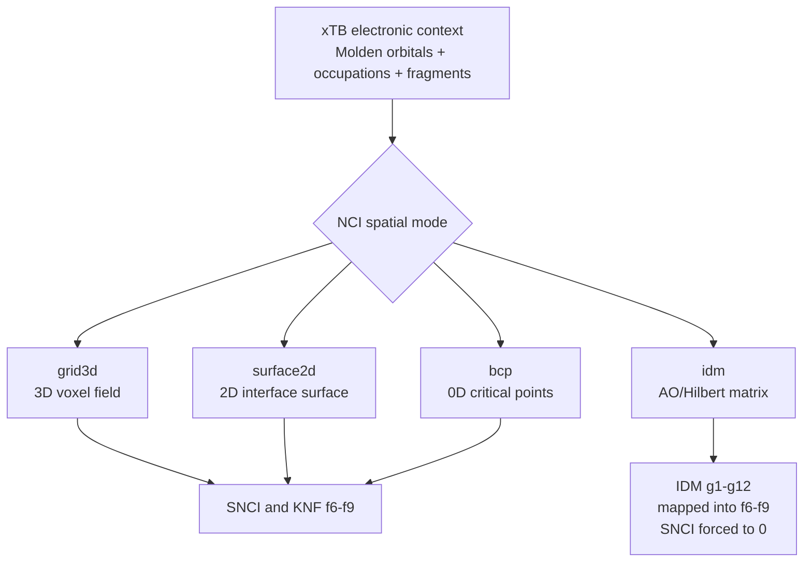
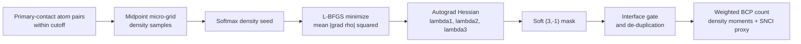
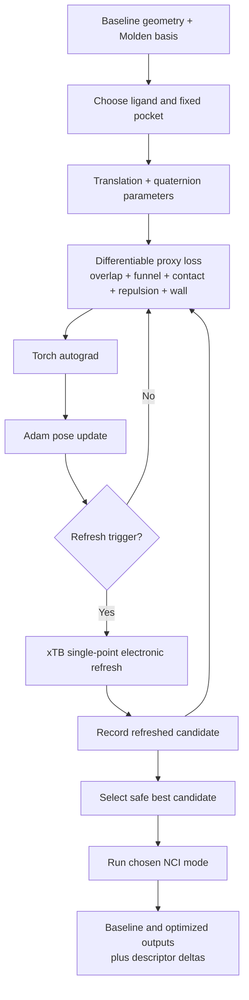

# NCIForge NCI Modes: Detailed Mathematical and Computational Reference

## Scope and build status

This document focuses only on the alternative NCI representations developed in
NCIForge:

1. `grid3d` — volumetric three-dimensional NCI field;
2. `surface2d` — two-dimensional interfacial manifold;
3. `bcp` — QTAIM-lite bond-critical-point representation;
4. `idm` — Hilbert-space interaction density matrix;
5. `poseopt` — the gradient-driven differentiable pose workflow that can be
   combined with an NCI representation.

It deliberately does not repeat the general xTB, WBO, KUID, SCDI, hydration,
batch, or atlas documentation except where one of those components directly
changes the meaning of an NCI mode.

### Critical branch distinction

The live checkout used for this audit is:

```text
branch: pre-main-testing
commit: 9dccfa8
package version: 1.0.9
```

That checked-out build exposes the volumetric three-dimensional calculation and
its CPU, CUDA, and Multiwfn execution backends. It does **not** expose the
multi-operator CLI option `--nci-spatial-mode`.

The four-mode implementation is preserved in the local `v34` build line,
commit `8ceed4f`, and in the related
`2.4-Differentiable-Pose-Optimizer` development line. In that build, the
selector is:

```text
--nci-spatial-mode {grid3d,surface2d,bcp,idm}
```

The detailed mode descriptions below are therefore an audit of the actual
mode-rich NCIForge implementation, while the availability column records
whether the mode is reachable in the currently checked-out build.

| Capability | Mathematical dimension | `pre-main-testing` checkout | Mode-rich `v34` build |
|---|---:|---:|---:|
| `grid3d` | 3D volume | Available and default | Available and default |
| `surface2d` | 2D sampled surface | Not wired into current CLI/source | Available |
| `bcp` | 0D critical points | Not wired into current CLI/source | Available |
| `idm` | Hilbert/AO matrix space | Not wired into current CLI/source | Available |
| `poseopt` | 6-DOF geometry optimization | Not wired into current CLI/source | Available as a modifier |

> **Terminology correction:** BCP is not the 2D mode. `surface2d` is the 2D,
> faster interfacial-manifold operator. BCP reduces the field to isolated
> topological points and is therefore a 0D representation. PoseOpt is the
> gradient-driven workflow; it is not a fifth NCI measure.

## Contents

1. [The common electronic foundation](#1-the-common-electronic-foundation)
2. [`grid3d`: volumetric three-dimensional NCI](#2-mode-1--grid3d-volumetric-three-dimensional-nci)
3. [`surface2d`: the fast two-dimensional interface mode](#3-mode-2--surface2d-the-fast-two-dimensional-interface-mode)
4. [`bcp`: QTAIM-lite bond critical points](#4-mode-3--bcp-qtaim-lite-bond-critical-points)
5. [`idm`: Hilbert-space interaction density matrix](#5-mode-4--idm-hilbert-space-interaction-density-matrix)
6. [What “gradient-like mode” means](#6-the-gradient-like-mode--what-actually-exists)
7. [PoseOpt](#7-poseopt--differentiable-gradient-driven-geometry-workflow)
8. [Direct mode comparison](#8-direct-mode-comparison)
9. [Stored 1HSG cross-method snapshot](#9-stored-1hsg-cross-method-snapshot)
10. [How each mode changes the result](#10-how-each-mode-changes-the-overall-nciforge-result)
11. [Mode-specific artifacts](#11-mode-specific-artifacts)
12. [Mode selection guide](#12-mode-selection-guide)
13. [Command surface](#13-command-surface-in-the-mode-rich-build)
14. [Complete control inventory](#14-complete-mode-control-inventory)
15. [Decision summary](#15-decision-summary)
16. [Audited sources](#16-audited-implementation-and-result-sources)

---

## 1. The common electronic foundation

All four NCI representations begin with the same electronic structure context:

- atom coordinates;
- atomic-orbital basis functions;
- molecular-orbital coefficients;
- orbital occupations;
- fragment assignments identifying the primary and contact sides of an
  interface.

For the Torch implementations these quantities are parsed from
`molden.input`.

### 1.1 Atomic and molecular orbitals

An atomic-orbital basis function centered on atom \(A\) has the implemented
Cartesian Gaussian form

$$
\phi_\mu(\mathbf r)
=
(x-X_A)^{l_x}
(y-Y_A)^{l_y}
(z-Z_A)^{l_z}
\sum_p d_{\mu p}
\exp\!\left[-\alpha_{\mu p}
\lVert\mathbf r-\mathbf R_A\rVert^2\right].
$$

Molecular orbital \(k\) is

$$
\psi_k(\mathbf r)
=
\sum_{\mu=1}^{N_{\mathrm{AO}}}
C_{\mu k}\phi_\mu(\mathbf r).
$$

The spin-summed density used by the real-space modes is

$$
\rho(\mathbf r)
=
\sum_k n_k\psi_k(\mathbf r)^2,
$$

where \(n_k\) is the Molden occupation of orbital \(k\).

### 1.2 Density gradient, Hessian, and RDG

The density gradient is

$$
\nabla\rho(\mathbf r)
=
\begin{bmatrix}
\partial\rho/\partial x\\
\partial\rho/\partial y\\
\partial\rho/\partial z
\end{bmatrix},
$$

and the density Hessian is

$$
\mathbf H_\rho(\mathbf r)
=
\begin{bmatrix}
\rho_{xx} & \rho_{xy} & \rho_{xz}\\
\rho_{xy} & \rho_{yy} & \rho_{yz}\\
\rho_{xz} & \rho_{yz} & \rho_{zz}
\end{bmatrix}.
$$

Let its ordered eigenvalues be

$$
\lambda_1 \le \lambda_2 \le \lambda_3.
$$

The reduced density gradient is

$$
s(\mathbf r)
=
\frac{1}
{2(3\pi^2)^{1/3}}
\frac{\lVert\nabla\rho(\mathbf r)\rVert}
{\rho(\mathbf r)^{4/3}}.
$$

The usual signed interaction-density coordinate is

$$
v(\mathbf r)
=
\operatorname{sign}\!\left(\lambda_2(\mathbf r)\right)
\rho(\mathbf r).
$$

The code interprets:

- \(v<0\): locally attractive density topology;
- \(v>0\): locally repulsive or sterically compressed topology;
- \(v\approx0\): weak or very low-density region.

This is a local density-topology indicator. It is not itself an interaction
energy.

### 1.3 What changes between modes

The four modes differ primarily in **where** and **how** the electronic signal
is sampled:

$$
\text{grid3d}:
\quad
\mathbf r\in\Omega\subset\mathbb R^3,
$$

$$
\text{surface2d}:
\quad
\mathbf r\in\mathcal S\subset\mathbb R^3,
\qquad \dim(\mathcal S)=2,
$$

$$
\text{bcp}:
\quad
\mathbf r\in\{\mathbf r_1^\ast,\ldots,\mathbf r_m^\ast\},
\qquad \dim=0,
$$

$$
\text{idm}:
\quad
\rho(\mathbf r)\text{ is not sampled;}
\quad
P,\ A,\ \Sigma\text{ are analyzed in matrix space}.
$$



---

## 2. Mode 1 — `grid3d`: volumetric three-dimensional NCI

### 2.1 Purpose

`grid3d` is the baseline and most direct real-space representation. It samples
the density throughout a rectangular volume surrounding the analyzed atoms.

It answers:

- Where in three-dimensional space is attractive density topology present?
- How extensive is that attractive region?
- What is the distribution of signed density within it?
- How does the complete interaction field change across geometries?

This is the best-supported mode when the objective is a conventional NCI field
or a spatially inspectable three-dimensional result.

### 2.2 Grid construction

For Cartesian coordinate \(a\in\{x,y,z\}\), atom-coordinate extrema are expanded
by padding \(p\):

$$
a_{\min}^{\mathrm{grid}}
=
\min_A a_A-p,
\qquad
a_{\max}^{\mathrm{grid}}
=
\max_A a_A+p.
$$

For spacing \(h\), the approximate number of points on an axis is

$$
N_a
\approx
\left\lfloor
\frac{a_{\max}^{\mathrm{grid}}-a_{\min}^{\mathrm{grid}}}{h}
\right\rfloor+1.
$$

The total voxel count is

$$
N_{\mathrm{grid}}=N_xN_yN_z.
$$

The mode-rich build defaults are:

| Parameter | Default | Effect |
|---|---:|---|
| `--nci-grid-spacing` | \(0.2\ \text{\AA}\) | Smaller values improve spatial resolution but increase cost approximately as \(h^{-3}\). |
| `--nci-grid-padding` | \(3.0\ \text{\AA}\) | Enlarges the box around the selected atoms. |
| `--nci-device` | `auto` | Selects CUDA when available, otherwise CPU. |
| `--nci-dtype` | `float32` | Controls compute precision and memory. |
| `--nci-batch-size` | 250,000 | Density-evaluation packet size. |
| `--nci-eig-batch-size` | 200,000 | Hessian eigensolver packet size. |
| `--nci-rho-floor` | \(10^{-12}\) | Prevents unstable division by very small density in RDG. |

If \(h\) is halved while the physical box remains fixed,

$$
N_{\mathrm{grid}}(h/2)\approx8N_{\mathrm{grid}}(h).
$$

This cubic scaling is the main reason the full-volume mode becomes expensive.

### 2.3 Density evaluation

At every voxel, NCIForge evaluates the AO basis matrix

$$
\mathbf\Phi_{i\mu}
=
\phi_\mu(\mathbf r_i),
$$

then the molecular-orbital values

$$
\mathbf\Psi
=
\mathbf\Phi\mathbf C,
$$

and finally

$$
\rho_i
=
\sum_k n_k\Psi_{ik}^2.
$$

Points are evaluated in batches so the full
\(N_{\mathrm{grid}}\times N_{\mathrm{AO}}\) basis matrix does not need to remain
resident at once.

### 2.4 Finite-difference gradient

At an interior voxel,

$$
\frac{\partial\rho}{\partial x}
\approx
\frac{\rho(x+h,y,z)-\rho(x-h,y,z)}{2h},
$$

with analogous formulas for \(y\) and \(z\). One-sided differences are used at
the box edges.

### 2.5 Finite-difference Hessian

Diagonal second derivatives use

$$
\frac{\partial^2\rho}{\partial x^2}
\approx
\frac{\rho(x+h)-2\rho(x)+\rho(x-h)}{h^2}.
$$

Mixed derivatives use the central stencil

$$
\frac{\partial^2\rho}{\partial x\,\partial y}
\approx
\frac{
\rho(x+h,y+h)-\rho(x+h,y-h)
-\rho(x-h,y+h)+\rho(x-h,y-h)
}{4h^2}.
$$

The Hessian is symmetrized before `torch.linalg.eigvalsh` is used. The middle
eigenvalue \(\lambda_2\) is retained.

### 2.6 RDG and attractive-point selection

The mode computes both

$$
s_i
=
\frac{1}
{2(3\pi^2)^{1/3}}
\frac{\lVert\nabla\rho_i\rVert}
{\max(\rho_i,\rho_{\mathrm{floor}})^{4/3}},
$$

and

$$
v_i=\operatorname{sign}(\lambda_{2,i})\rho_i.
$$

However, the downstream SNCI and \(f_6\)-\(f_9\) implementation in this build
selects attractive samples only by

$$
\mathcal A=\{i:v_i<0\}.
$$

It does **not** impose an RDG cutoff during these aggregations. RDG is exported,
but it is not part of the default attractive-point mask.

### 2.7 Volumetric SNCI

With voxel volume

$$
\Delta V=h_xh_yh_z,
$$

the implemented SNCI is

$$
\mathrm{SNCI}_{3D}
=
\sum_{i\in\mathcal A}
(-v_i)\Delta V.
$$

This behaves like a volume integral over negative signed density.

### 2.8 Volumetric \(f_6\)-\(f_9\)

The implementation uses

$$
f_6^{3D}=|\mathcal A|,
$$

$$
f_7^{3D}
=
\frac{1}{|\mathcal A|}
\sum_{i\in\mathcal A}v_i,
$$

$$
f_8^{3D}
=
\sqrt{
\frac{1}{|\mathcal A|}
\sum_{i\in\mathcal A}(v_i-f_7^{3D})^2
},
$$

and the population skewness

$$
f_9^{3D}
=
\frac{1}{|\mathcal A|}
\sum_{i\in\mathcal A}
\left(
\frac{v_i-f_7^{3D}}{f_8^{3D}}
\right)^3.
$$

#### Important resolution dependence

\(f_6^{3D}\) is a voxel count. It is not a physical volume unless multiplied
by \(\Delta V\):

$$
V_{\mathrm{attractive}}
\approx
f_6^{3D}\Delta V.
$$

Changing grid spacing therefore changes raw \(f_6\), even when the underlying
field is nearly unchanged.

### 2.9 Execution flow

```mermaid
flowchart LR
    A["Parse Molden<br/>AO basis, C, occupations"] --> B["Build padded 3D lattice"]
    B --> C["Evaluate rho in batches"]
    C --> D["Finite differences<br/>gradient + Hessian"]
    D --> E["Hessian eigenvalues<br/>retain lambda2"]
    E --> F["Compute RDG and sign(lambda2)rho"]
    F --> G["Select negative signed-density voxels"]
    G --> H["SNCI volume integral<br/>and f6-f9 moments"]
    H --> I["nci_grid.npz<br/>optional nci_grid.txt"]
```



### 2.10 System impact

#### CPU

The cost is dominated by:

1. AO evaluation at every voxel;
2. the matrix product producing MO values;
3. Hessian eigendecomposition at every voxel.

A useful high-level scaling model is

$$
T_{3D}
\sim
O(N_{\mathrm{grid}}N_{\mathrm{AO}}N_{\mathrm{MO}})
+
O(N_{\mathrm{grid}}),
$$

where the second term hides the constant cost of \(3\times3\) eigenproblems.

#### GPU

Large density batches and many independent \(3\times3\) eigensystems are
parallelizable. GPU acceleration is most useful once the grid and basis are
large enough to amortize:

- host-to-device transfers;
- kernel-launch overhead;
- output transfer;
- CUDA warm-up.

Small calculations can be faster on CPU.

#### Memory

Peak memory depends on batch size, the full density lattice, derivative arrays,
and Hessian batches. Reducing `--nci-batch-size` and
`--nci-eig-batch-size` lowers peak memory at the cost of more batches.

#### Storage

The binary NPZ contains grid axes, signed density, and RDG. A full text export
can be much larger and slower to write.

### 2.11 Existing results

#### Torch versus Multiwfn baseline

The stored benchmark
`v34:nci_compare/comprehensive_speed_accuracy_report.json` evaluated
1,762,490 voxels on an RTX 3050 6 GB system.

| Engine | Average time without text write | Speedup versus Multiwfn |
|---|---:|---:|
| Multiwfn | 22.3983 s | \(1.000\times\) |
| Torch CPU, float64 | 5.0603 s | \(2.513\times\) |
| Torch CUDA, float64 | 3.5645 s | \(3.006\times\) |

In the stored low-RDG subset, defined by \(s\le2\), the Torch result agreed
strongly with the Multiwfn reference:

$$
r_{\mathrm{Pearson}}(v)\approx0.990095,
$$

$$
r_{\mathrm{Pearson}}(s)\approx0.998957.
$$

These are backend-agreement figures for the stored system. They do not prove
that every grid, basis, or molecule will have identical errors.

#### 1HSG pocket grid result

The direct mode-comparison artifact records:

| Quantity | `grid3d` |
|---|---:|
| Atoms | 224 |
| Basis functions | 896 |
| Grid shape | \(91\times108\times101\) |
| Points | 992,628 |
| Field-compute time | 82.4069 s |
| Total NCI elapsed | 83.4972 s |
| SNCI | 540.8330 |
| \(f_6\) | 692,722 |
| \(f_7\) | -0.0144616 |
| \(f_8\) | 0.0642089 |
| \(f_9\) | -7.0873970 |

This was a CPU run with a local atom shell but a three-dimensional voxel box.

### 2.12 Strengths

- Most direct spatial representation.
- Produces an inspectable 3D NCI field.
- Retains both attractive and repulsive regions in the stored field.
- Best basis for conventional NCI visualization.
- Strongest stored backend-comparison evidence.
- Compatible with CPU, CUDA, and the historical Multiwfn route.

### 2.13 Limitations

- Cubic growth with spatial resolution.
- Raw \(f_6\) depends on voxel spacing.
- Large memory and output footprint.
- Default summary aggregation ignores RDG when selecting attractive points.
- A large box may spend most computation on chemically unimportant space.
- Grid edges and finite-difference spacing introduce numerical choices.

---

## 3. Mode 2 — `surface2d`: the fast two-dimensional interface mode

### 3.1 Purpose

`surface2d` replaces the full three-dimensional box with a sampled
ligand-centered solvent-accessible surface near the opposing fragment.

It answers:

- What attractive density topology is present on the molecular interface?
- What is the effective attractive surface area?
- How are signed-density values distributed across that interface?

This is the actual 2D mode and the stored 1HSG comparison shows the large
speedup associated with it.

### 3.2 Surface generation

For primary atom \(a\), define a solvent-accessible radius

$$
R_a^{\mathrm{SAS}}
=
R_a^{\mathrm{vdW}}+R_{\mathrm{probe}}.
$$

The implementation generates approximately uniform unit directions
\(\hat{\mathbf u}_k\) with a Fibonacci sphere and proposes

$$
\mathbf r_{a,k}
=
\mathbf R_a
+R_a^{\mathrm{SAS}}\hat{\mathbf u}_k.
$$

The default programmatic settings are:

| Parameter | Default | Meaning |
|---|---:|---|
| `nci_surface_points_per_atom` | 120 | Fibonacci directions proposed for every primary atom |
| `nci_surface_probe_radius` | \(1.4\ \text{\AA}\) | Probe added to the vdW radius |
| `nci_surface_interface_cutoff` | \(4.5\ \text{\AA}\) | Maximum distance from a retained point to a contact atom |
| `nci_surface_fd_step` | \(0.08\ \text{\AA}\) | Finite-difference step for derivatives |
| `nci_surface_keep_backface` | `False` | Remove points facing away from the contact side |

In the audited `v34` CLI these values are supplied through pipeline defaults;
unlike the BCP and IDM controls, explicit `--nci-surface-*` flags are not
declared in `knf_core/main.py`.

### 3.3 Occlusion filter

A proposed point on atom \(a\) is removed if it lies inside another primary
atom's solvent-accessible sphere:

$$
\lVert\mathbf r_{a,k}-\mathbf R_b\rVert
<
R_b^{\mathrm{SAS}},
\qquad b\ne a.
$$

This approximates the externally visible union of atomic spheres.

### 3.4 Interface-distance filter

Let \(\mathcal C\) be the contact atoms. A point is retained only if

$$
\min_{j\in\mathcal C}
\lVert\mathbf r_{a,k}-\mathbf R_j\rVert
\le r_{\mathrm{int}}.
$$

With backface culling enabled, the outward surface normal must also point
toward the nearest contact atom:

$$
\hat{\mathbf u}_k\cdot
(\mathbf R_{j^\ast}-\mathbf r_{a,k})
>0.
$$

This discards the remote side of the primary molecule and concentrates samples
on the intermolecular interface.

### 3.5 Area quadrature

Every retained point inherits the original per-direction area quota:

$$
\Delta A_{a,k}
=
\frac{4\pi(R_a^{\mathrm{SAS}})^2}
{N_{\mathrm{directions}}}.
$$

The implementation does not renormalize the retained points to the full sphere
area. Consequently, summing retained weights approximates the retained
interface area.

### 3.6 Why it still computes three-dimensional derivatives

The sampling manifold is 2D, but the density is still a scalar field in
three-dimensional space. At each surface point, NCIForge evaluates density on
a 19-point Cartesian stencil:

- 1 center;
- 6 axial shifts;
- 12 mixed-coordinate shifts.

For example,

$$
\rho_x
\approx
\frac{\rho(\mathbf r+h\hat x)-\rho(\mathbf r-h\hat x)}{2h},
$$

and

$$
\rho_{xy}
\approx
\frac{
\rho(\mathbf r+h\hat x+h\hat y)
-\rho(\mathbf r+h\hat x-h\hat y)
-\rho(\mathbf r-h\hat x+h\hat y)
+\rho(\mathbf r-h\hat x-h\hat y)
}{4h^2}.
$$

Therefore, surface2d is not a purely geometric surface-area calculation. It
still recovers the full three-dimensional density gradient and Hessian at each
retained surface point.

### 3.7 Surface SNCI

Let

$$
\mathcal A_S
=
\{i\in\mathcal S:v_i<0\}.
$$

The surface integral is

$$
\mathrm{SNCI}_{2D}
=
\sum_{i\in\mathcal A_S}
(-v_i)\Delta A_i.
$$

This has a surface measure, not a volume measure. It cannot be interpreted on
the same absolute scale as \(\mathrm{SNCI}_{3D}\).

### 3.8 Surface \(f_6\)-\(f_9\)

The surface mode uses area-weighted descriptors:

$$
f_6^{2D}
=
\sum_{i\in\mathcal A_S}\Delta A_i,
$$

$$
f_7^{2D}
=
\frac{
\sum_{i\in\mathcal A_S}\Delta A_i v_i
}{
\sum_{i\in\mathcal A_S}\Delta A_i
},
$$

$$
f_8^{2D}
=
\sqrt{
\frac{
\sum_{i\in\mathcal A_S}
\Delta A_i(v_i-f_7^{2D})^2
}{
\sum_{i\in\mathcal A_S}\Delta A_i
}
},
$$

$$
f_9^{2D}
=
\frac{
\sum_{i\in\mathcal A_S}
\Delta A_i
\left(
\frac{v_i-f_7^{2D}}{f_8^{2D}+\epsilon}
\right)^3
}{
\sum_{i\in\mathcal A_S}\Delta A_i
}.
$$

Here \(f_6^{2D}\) is an attractive interface area, stored in bohr squared in
the default binary output. It is not a count.

### 3.9 Execution flow

```mermaid
flowchart LR
    A["Primary and contact atom sets"] --> B["Fibonacci sphere samples<br/>around primary atoms"]
    B --> C["Remove points occluded<br/>by other primary spheres"]
    C --> D["Keep contact-near<br/>front-facing points"]
    D --> E["19 density evaluations<br/>per retained point"]
    E --> F["Gradient + Hessian<br/>lambda2 + RDG"]
    F --> G["Negative sign(lambda2)rho points"]
    G --> H["Area-weighted SNCI<br/>and f6-f9"]
```



### 3.10 System impact

Before culling, point count is approximately

$$
N_{\mathrm{proposal}}
=
N_{\mathrm{primary\ atoms}}
N_{\mathrm{directions}}.
$$

The density-evaluation workload is approximately

$$
N_{\rho,\ 2D}
\approx
19N_{\mathrm{surface}}.
$$

Although every retained surface point needs 19 density calculations, the
retained point count can be hundreds rather than hundreds of thousands or
millions. That reduction dominates the extra per-point stencil cost.

#### CPU and GPU

- CPU performance is often already good because the retained point set is
  small.
- CUDA may help for a large interface, but very small surfaces may not amortize
  GPU startup and transfer overhead.
- The mode avoids a full 3D density lattice, full-grid derivative arrays, and
  million-point Hessian storage.

#### Memory

Memory scales with retained surface points rather than the enclosing volume:

$$
M_{2D}\sim O(N_{\mathrm{surface}}).
$$

This is usually much smaller than

$$
M_{3D}\sim O(N_xN_yN_z).
$$

#### Fragment-selection sensitivity

The surface is constructed around the selected primary fragment and filtered
against selected contact atoms. Incorrect ligand/pocket assignment changes the
surface itself, not just a post-processing mask.

### 3.11 Existing direct result: 1HSG pocket

The stored artifact
`v34:nci_compare/2d_interfacial_manifold/compare_1HSG_pocket_grid3d_vs_surface2d.json`
compares the two modes using the same Molden wavefunction and selected
interface.

| Quantity | `grid3d` | `surface2d` |
|---|---:|---:|
| Samples | 992,628 voxels | 315 surface points |
| Field-compute time | 82.4069 s | 3.9703 s |
| Total elapsed | 83.4972 s | 3.9908 s |
| SNCI | 540.8330 | 17.5414 |
| \(f_6\) | 692,722 voxels | 704.7393 bohr\(^2\) |
| \(f_7\) | -0.0144616 | -0.0248906 |
| \(f_8\) | 0.0642089 | 0.0690276 |
| \(f_9\) | -7.0873970 | -3.9964530 |

Measured speedups were

$$
\frac{T_{\mathrm{grid3d,compute}}}
{T_{\mathrm{surface2d,compute}}}
=20.7557,
$$

and

$$
\frac{T_{\mathrm{grid3d,total}}}
{T_{\mathrm{surface2d,total}}}
=20.9222.
$$

The surface metadata reported:

- 315 retained points;
- 209 attractive points;
- total sampled surface area \(297.7771\ \text{\AA}^2\);
- attractive area \(704.7393\ \text{bohr}^2\);
- default 120 directions per primary atom.

### 3.12 Existing campaign result

The stored four-complex full-versus-pocket campaign reports:

| Category | Result |
|---|---:|
| Total attempted | 8 |
| Pocket successes | 4/4 |
| Full-complex successes | 0/4 |
| Mean pocket elapsed | 3.5743 s |
| Mean pocket field time | 3.5510 s |
| Mean retained surface points | 570.25 |

The full-complex failures occurred in the upstream xTB single-point step. They
do not establish a failure of the surface operator itself.

### 3.13 Why the numeric outputs differ from grid3d

The two modes integrate over different measures:

$$
\mathrm{grid3d}:
\quad
\int_{\Omega}(-v)\,dV,
$$

$$
\mathrm{surface2d}:
\quad
\int_{\mathcal S}(-v)\,dA.
$$

Therefore:

- SNCI values are not expected to match;
- \(f_6^{3D}\) is a voxel count;
- \(f_6^{2D}\) is an area;
- equal values would be coincidental, not evidence of equivalence.

Cross-mode machine-learning use requires separate calibration or an explicit
mode indicator.

### 3.14 Strengths

- Large measured speedup on the stored pocket case.
- Directly concentrates on the intermolecular interface.
- Much smaller memory and output footprint.
- Retains RDG and signed-density information.
- Produces an intuitive attractive-interface area.

### 3.15 Limitations

- Not quantitatively interchangeable with a volume integral.
- Sensitive to primary/contact fragment identification.
- Sensitive to sphere resolution, probe radius, contact cutoff, and backface
  policy.
- Surface construction is an atom-sphere approximation, not an exact
  density-derived isosurface.
- The audited CLI does not expose its numerical controls as direct flags.
- Stored evidence is strong for pocket timing but limited for full-system
  robustness.

---

## 4. Mode 3 — `bcp`: QTAIM-lite bond critical points

### 4.1 Purpose

The BCP mode searches for a sparse set of points where the density gradient is
near zero and the Hessian has the bond-critical-point signature.

It answers:

- Is there a density-topological connection between atoms on opposite
  fragments?
- How many soft BCP-like contacts exist?
- What density is associated with those topological contacts?
- How concentrated or heterogeneous are those critical-point densities?

This is a topological representation. It is not a 2D surface.

### 4.2 QTAIM critical-point signature

A critical point satisfies

$$
\nabla\rho(\mathbf r^\ast)=\mathbf 0.
$$

A bond critical point has rank 3 and signature \(-1\), conventionally written
\((3,-1)\). With ordered eigenvalues:

$$
\lambda_1<0,\qquad
\lambda_2<0,\qquad
\lambda_3>0.
$$

The two negative curvatures describe local concentration perpendicular to the
bond path, while the positive curvature describes depletion along the bond-path
direction.

NCIForge implements a differentiable, soft QTAIM-like selector rather than a
hard, formally exact topological partition.

### 4.3 Interfragment pair generation

Let \(\mathcal P\) be primary atoms and \(\mathcal C\) contact atoms.
Candidate pairs are

$$
\mathcal E
=
\left\{
(i,j):
i\in\mathcal P,
j\in\mathcal C,
d_{ij}\le r_{\mathrm{pair}}
\right\}.
$$

Defaults:

| Option | Default | Role |
|---|---:|---|
| `--nci-bcp-pair-cutoff` | \(4.5\ \text{\AA}\) | Maximum primary-contact atom distance |
| `--nci-bcp-max-pairs` | 2048 | Maximum number of nearest candidate pairs |

If the candidate count exceeds the limit, the shortest-distance pairs are
retained.

### 4.4 Soft micro-grid seeding

The midpoint for pair \((i,j)\) is

$$
\mathbf m_{ij}
=
\frac{\mathbf R_i+\mathbf R_j}{2}.
$$

A small odd-sized Cartesian grid is placed around it:

$$
\mathbf r_{ij,k}
=
\mathbf m_{ij}+\boldsymbol\delta_k.
$$

Defaults:

| Option | Default |
|---|---:|
| `--nci-bcp-micro-grid-size` | 3 |
| `--nci-bcp-micro-grid-spacing` | \(0.3\ \text{\AA}\) |

For the default \(3^3\) grid, every pair has 27 seed samples.

The seed is a soft density maximum:

$$
w_{ij,k}
=
\frac{
\exp(\rho_{ij,k}/T)
}{
\sum_l\exp(\rho_{ij,l}/T)
},
$$

$$
\mathbf r_{ij}^{(0)}
=
\sum_k w_{ij,k}\mathbf r_{ij,k}.
$$

The default softmax temperature is

$$
T=0.01.
$$

Lower \(T\) approaches a hard maximum. Higher \(T\) averages a wider portion of
the micro-grid.

### 4.5 Critical-point optimization

The coordinates of all pair seeds are optimized to minimize

$$
\mathcal L_{\mathrm{grad}}
=
\frac{1}{N_{\mathrm{pairs}}}
\sum_i
\left\|
\nabla\rho(\mathbf r_i)
\right\|^2.
$$

The primary solver is L-BFGS with:

- maximum iterations: 20;
- gradient tolerance: \(10^{-5}\);
- history size: 20;
- strong-Wolfe line search.

If L-BFGS raises a runtime failure, the implementation falls back to Adam:

$$
N_{\mathrm{Adam}}
=
\max(8,3N_{\mathrm{LBFGS,max}}),
$$

with learning rate 0.03.

Unlike grid3d and surface2d, BCP obtains derivatives with Torch autograd. The
first derivative is differentiated again to build the Hessian.

### 4.6 Soft critical-point mask

Because numerical optimization rarely lands on an exact mathematical critical
point, the code uses soft sigmoid gates.

Gradient stationarity:

$$
M_\nabla
=
\sigma\!\left[
-\alpha
\left(
\lVert\nabla\rho\rVert-\tau_g
\right)
\right].
$$

Eigenvalue-sign gates:

$$
M_1=\sigma(-\alpha\lambda_1),
$$

$$
M_2=\sigma(-\alpha\lambda_2),
$$

$$
M_3=\sigma(+\alpha\lambda_3).
$$

The soft BCP signature is

$$
M_{\mathrm{BCP}}
=
M_\nabla M_1M_2M_3.
$$

Defaults:

| Option | Default |
|---|---:|
| `--nci-bcp-grad-tolerance` | \(10^{-3}\) |
| `--nci-bcp-mask-alpha` | 60 |

Larger \(\alpha\) makes the selector behave more like a hard threshold.

### 4.7 Intermolecular gate

For an optimized point, define distances to the nearest atom on each side:

$$
d_P(\mathbf r)
=
\min_{i\in\mathcal P}
\lVert\mathbf r-\mathbf R_i\rVert,
$$

$$
d_C(\mathbf r)
=
\min_{j\in\mathcal C}
\lVert\mathbf r-\mathbf R_j\rVert.
$$

The soft interface gate is

$$
G_P
=
\sigma[\alpha(r_{\mathrm{pair}}-d_P)],
$$

$$
G_C
=
\sigma[\alpha(r_{\mathrm{pair}}-d_C)],
$$

$$
G_{\mathrm{interface}}=G_PG_C.
$$

This suppresses optimized stationary points that are not close to both
fragments.

### 4.8 Soft de-duplication

Multiple atom pairs may converge onto the same physical critical point. For
optimized points \(i,j\):

$$
K_{ij}
=
\exp\!\left[
-\frac12
\left(
\frac{d_{ij}}{\sigma_d}
\right)^2
\right].
$$

Self-contributions are removed, and the uniqueness weight is

$$
u_i
=
\frac{1}
{1+\sum_{j\ne i}K_{ij}}.
$$

The default de-duplication radius is

$$
\sigma_d=0.15\ \text{\AA}.
$$

### 4.9 Final point weight

The final soft contribution of candidate \(i\) is

$$
W_i
=
M_{\mathrm{BCP},i}
G_{\mathrm{interface},i}
u_i.
$$

This is a continuous count weight, not a Boolean decision.

### 4.10 BCP descriptors

#### Soft critical-point count

$$
f_6^{\mathrm{BCP}}
=
\sum_iW_i.
$$

Because \(0\le W_i\le1\), \(f_6\) can be fractional.

#### Area/curvature proxy

The code additionally reports

$$
f_{6,\mathrm{area}}^{\mathrm{BCP}}
=
\sum_i
W_i
\log\!\left[
1+
\frac{k}
{|\lambda_{1,i}\lambda_{2,i}|+\epsilon}
\right],
$$

where the default scale is \(k=1\) and
\(\epsilon=10^{-6}\).

This is a regularized curvature proxy. It is not a geometric area obtained by
surface integration.

#### Density moments

The BCP mode maps the weighted density distribution to

$$
f_7^{\mathrm{BCP}}
=
\frac{\sum_iW_i\rho_i}
{\sum_iW_i+\epsilon},
$$

$$
f_8^{\mathrm{BCP}}
=
\sqrt{
\frac{\sum_iW_i(\rho_i-f_7)^2}
{\sum_iW_i+\epsilon}
},
$$

$$
f_9^{\mathrm{BCP}}
=
\frac{\sum_iW_i
\left[
(\rho_i-f_7)/(f_8+\epsilon)
\right]^3}
{\sum_iW_i+\epsilon}.
$$

This is another important cross-mode difference:

- grid3d and surface2d summarize \(v=\operatorname{sign}(\lambda_2)\rho\);
- BCP \(f_7\)-\(f_9\) summarize positive \(\rho\) under the soft BCP weights.

#### BCP SNCI proxy

The BCP-specific proxy is

$$
\mathrm{SNCI}_{\mathrm{BCP}}
=
\sum_i
\max[-v_i,0]W_i.
$$

It is a weighted sum over sparse critical points, not a volume or surface
integral.

### 4.11 RDG behavior

The BCP output stores the optimized point coordinates, weights, and
\(\operatorname{sign}(\lambda_2)\rho\), but its exported `rdg` array is filled
with zeros.

Therefore:

- BCP selection is based on gradient stationarity and Hessian signature;
- it does not provide a meaningful sampled RDG field;
- downstream interpretation must not treat its zero RDG values as physical
  \(s(\mathbf r)=0\).

### 4.12 Execution flow



### 4.13 System impact

The candidate-pair stage scales nominally as

$$
O(N_PN_C)
$$

for the distance matrix, followed by a hard cap of 2,048 nearest pairs.

Micro-grid density evaluations scale as

$$
N_{\mathrm{pairs}}q^3,
$$

where \(q=3\) by default.

The optimization then performs repeated first- and second-derivative autograd
operations at the candidate coordinates. The number of spatial samples is
tiny compared with grid3d, but each sample is computationally more complex.

#### Precision

The implementation forces the BCP solver to float64 even if another dtype was
requested. This improves numerical stability but increases memory and can make
some GPUs slower.

#### GPU suitability

BCP can use the Torch device for density and autograd calculations. Its
relatively small, iterative optimization workload may not achieve the same GPU
utilization as a large regular grid.

#### Failure conditions

The mode fails explicitly if:

- either primary or contact atom sets are empty;
- fewer than two usable fragments are available;
- no cross-fragment atom pair is within the cutoff.

### 4.14 Existing exploratory results

Two stored 1HSG-pocket NPZ artifacts show strong sensitivity to the
selector/initialization variant:

| Artifact | Reported points | SNCI proxy | \(f_6\) | \(f_7\) | \(f_8\) | \(f_9\) |
|---|---:|---:|---:|---:|---:|---:|
| `nci_bcp_test_1HSG_pocket.npz` | 4 | 0.0001009 | 0.2130 | -0.0004737 | 0.0002959 | 0.4451 |
| `nci_bcp_test_1HSG_pocket_ligheur.npz` | 146 | 0.0747186 | 4.3760 | -0.0170747 | 0.1168880 | -9.0049 |

These stored exploratory files predate or differ from portions of the final
weighted-density override semantics, which is another reason to treat them as
calibration evidence rather than production reference values.

No trustworthy BCP wall-time benchmark comparable to the 1HSG
grid3d/surface2d timing is present in the tracked artifacts.

### 4.15 Strengths

- Very sparse representation.
- Directly targets density topology rather than empty spatial volume.
- Soft masks avoid a brittle all-or-nothing critical-point selector.
- Soft de-duplication reduces repeated convergence onto one point.
- Can provide interpretable contact-level topology.

### 4.16 Limitations

- Experimental calibration maturity.
- Strong sensitivity to atom-pair selection, initial seeds, tolerances, and
  mask sharpness.
- Not 2D and not an area-preserving reduction of grid3d.
- BCP \(f_7\)-\(f_9\) have different semantics from grid/surface values.
- Exported RDG is a placeholder zero array.
- Sparse critical points discard diffuse interaction regions that do not
  create a clean stationary point.
- No stored end-to-end speed benchmark establishes that it is always faster
  than surface2d.

---

## 5. Mode 4 — `idm`: Hilbert-space interaction density matrix

### 5.1 Purpose

IDM avoids real-space sampling. It works directly with orbital coefficients,
occupations, AO ownership, and an atom-condensed cross-fragment density matrix.

It answers:

- How much one-particle density coupling exists between the two fragments?
- Is coupling concentrated in a few atom pairs or distributed broadly?
- How many effective coupling channels exist?
- What is the spectral complexity of the ligand-pocket coupling matrix?

It is intended as a compact, ML-facing electronic interaction descriptor.

### 5.2 Density matrix

Let

$$
\mathbf C\in\mathbb R^{N_{\mathrm{AO}}\times N_{\mathrm{MO}}}
$$

be the AO-to-MO coefficient matrix and

$$
\mathbf N=\operatorname{diag}(n_1,\ldots,n_{N_{\mathrm{MO}}})
$$

the occupation matrix.

The implemented one-particle AO density matrix is

$$
\mathbf P
=
\mathbf C\mathbf N\mathbf C^\mathsf T.
$$

In code this is evaluated as

$$
\mathbf P
=
(\mathbf C\odot\mathbf n^\mathsf T)\mathbf C^\mathsf T.
$$

### 5.3 Löwdin orthogonalization

For a nonorthogonal AO overlap matrix \(\mathbf S\), the formal transformation
is constructed from

$$
\mathbf S
=
\mathbf U
\operatorname{diag}(s_1,\ldots,s_m)
\mathbf U^\mathsf T,
$$

$$
\mathbf S^{-1/2}
=
\mathbf U
\operatorname{diag}
\left(
\frac{1}{\sqrt{\max(s_i,\epsilon)}}
\right)
\mathbf U^\mathsf T.
$$

The implementation then uses

$$
\mathbf P_\perp
=
\mathbf S^{-1/2}
\mathbf P
\mathbf S^{-1/2}.
$$

#### Current approximation

The Molden parser does not provide an AO overlap matrix. The only accepted
CLI overlap model is:

```text
--idm-overlap-model identity
```

Thus

$$
\mathbf S=\mathbf I
\quad\Longrightarrow\quad
\mathbf P_\perp=\mathbf P.
$$

The code also reports `identity_fallback` if a nonimplemented overlap name
reaches the programmatic API.

This is the central approximation in the present IDM implementation.

### 5.4 Fragment partition

One fragment is selected as the primary or ligand fragment \(L\). Every other
fragment is combined into the pocket side \(R\).

If no explicit primary index is valid, the code chooses the smallest nonempty
fragment.

Let:

- \(\Omega_i\) be the AO indices centered on ligand atom \(i\);
- \(\Omega_j\) be the AO indices centered on pocket atom \(j\).

### 5.5 Atom-pair coupling matrix

For ligand atom \(i\) and pocket atom \(j\), extract the density-matrix block

$$
\mathbf B^{(ij)}
=
\mathbf P_\perp[\Omega_i,\Omega_j].
$$

Its Frobenius norm defines the unsigned coupling:

$$
A_{ij}
=
\left\|
\mathbf B^{(ij)}
\right\|_F
=
\sqrt{
\sum_{\mu\in\Omega_i}
\sum_{\nu\in\Omega_j}
\left|P_{\perp,\mu\nu}\right|^2
}.
$$

This condenses a variable-size AO block into one nonnegative atom-pair value.

#### Information deliberately discarded

The Frobenius norm removes:

- sign;
- orbital phase;
- cancellation within the AO block;
- the internal pattern of individual AO couplings.

It retains total block magnitude.

### 5.6 Optional distance damping

For atom-pair distance \(d_{ij}\), the optional geometric damping is

$$
D_{ij}
=
\exp(-\alpha d_{ij}),
$$

$$
A_{ij}^\ast
=
A_{ij}D_{ij}.
$$

The option is

```text
--idm-distance-damping-alpha ALPHA
```

with units of inverse angstrom and default

$$
\alpha=0.
$$

Thus the default IDM is not explicitly distance damped.

### 5.7 Size normalization

For \(N_L\) ligand atoms and \(N_R\) pocket atoms:

$$
\widehat{\mathbf A}
=
\frac{\mathbf A^\ast}
{\sqrt{N_LN_R}+\epsilon}.
$$

The default regularizer is

$$
\epsilon=10^{-10}.
$$

This reduces direct growth with the number of atom pairs, but it does not make
all systems strictly size invariant.

### 5.8 Singular-value decomposition

The coupling matrix is decomposed as

$$
\widehat{\mathbf A}
=
\mathbf U\mathbf\Sigma\mathbf V^\mathsf T,
$$

$$
\mathbf\Sigma
=
\operatorname{diag}(\sigma_1,\ldots,\sigma_r),
\qquad
r=\min(N_L,N_R).
$$

Singular values describe orthogonal ligand-pocket coupling channels without
depending on row or column ordering.

### 5.9 IDM feature set \(g_1\)-\(g_{12}\)

#### Matrix-magnitude features

$$
g_1
=
\log\!\left(
1+\lVert\widehat{\mathbf A}\rVert_F
\right),
$$

$$
g_2
=
\log\!\left(
1+\max_{ij}\widehat A_{ij}
\right),
$$

$$
g_3
=
\operatorname{mean}_{ij}
\widehat A_{ij},
$$

$$
g_4
=
\operatorname{std}_{ij}
\widehat A_{ij}.
$$

Interpretation:

- \(g_1\): total normalized coupling magnitude;
- \(g_2\): strongest atom-pair coupling;
- \(g_3\): mean coupling density over all ligand-pocket pairs;
- \(g_4\): heterogeneity of atom-pair coupling.

#### Singular-spectrum moments

$$
g_5
=
\frac1r\sum_{k=1}^{r}\sigma_k,
$$

$$
g_6
=
\frac1r\sum_{k=1}^{r}
(\sigma_k-g_5)^2,
$$

$$
g_7
=
\frac1r\sum_{k=1}^{r}
\left(
\frac{\sigma_k-g_5}
{\sqrt{g_6}+\epsilon}
\right)^3.
$$

Interpretation:

- \(g_5\): mean coupling-channel strength;
- \(g_6\): variance of channel strengths;
- \(g_7\): spectral skew, indicating dominance by a long strong-channel tail.

#### Spectral entropy

Define normalized singular weights

$$
p_k
=
\frac{\sigma_k}
{\sum_l\sigma_l+\epsilon}.
$$

Then

$$
g_8
=
-\sum_kp_k\log(p_k+\epsilon).
$$

Large \(g_8\) means coupling is distributed over more channels.

#### Normalized effective ranks

Entropy-based effective rank:

$$
g_9
=
\frac{\exp(g_8)}
{r+\epsilon}.
$$

Participation-ratio effective rank:

$$
g_{10}
=
\frac{
(\sum_k\sigma_k)^2
}{
\sum_k\sigma_k^2+\epsilon
}
\frac1{r+\epsilon}.
$$

Both are normalized by the maximum possible rank.

#### Coupling sparsity

For threshold \(\tau\):

$$
g_{11}
=
\frac{
\#\{(i,j):\widehat A_{ij}>\tau\}
}{
N_LN_R
}.
$$

The default is

$$
\tau=10^{-3}.
$$

#### Ninety-percent rank fraction

Let \(k_{90}\) be the smallest integer such that

$$
\sum_{k=1}^{k_{90}}\sigma_k
\ge
0.9\sum_{k=1}^{r}\sigma_k.
$$

Then

$$
g_{12}
=
\frac{k_{90}}{r}.
$$

Small \(g_{12}\) means a small fraction of channels captures most coupling.

### 5.10 Mapping into the nine-dimensional KNF vector

The implemented compatibility mapping is

$$
f_6\leftarrow g_1,
$$

$$
f_7\leftarrow g_5,
$$

$$
f_8\leftarrow\sqrt{g_6},
$$

$$
f_9\leftarrow g_7.
$$

These are not estimates of voxel count, signed-density mean, signed-density
standard deviation, and signed-density skew. They are matrix/spectral
surrogates placed into the same vector positions.

Any model that mixes `grid3d` and `idm` rows must know which mode generated the
row.

### 5.11 SNCI and real-space output behavior

In `idm` mode:

```text
nci_status = skipped_idm_mode
nci_data_path = null
SNCI = 0.0
```

No `nci_grid.npz` field is produced by the IDM path, because it does not
evaluate:

- \(\rho(\mathbf r)\) on a spatial grid;
- \(\nabla\rho(\mathbf r)\);
- \(\mathbf H_\rho(\mathbf r)\);
- \(\lambda_2(\mathbf r)\);
- RDG.

The zero SNCI is a pipeline convention indicating that volumetric/surface SNCI
was not calculated. It does not mean that the physical system has zero
noncovalent interaction.

### 5.12 Execution flow

```mermaid
flowchart LR
    A["Parse Molden<br/>C, occupations, AO centers"] --> B["Build AO density matrix<br/>P = C N C transpose"]
    B --> C["Identity or Lowdin<br/>orthogonalization path"]
    C --> D["Split primary ligand<br/>from remaining pocket"]
    D --> E["AO-block Frobenius norms<br/>A(i,j)"]
    E --> F["Optional distance damping<br/>and size normalization"]
    F --> G["SVD of coupling matrix"]
    G --> H["Compute g1-g12"]
    H --> I["Map g1,g5,sqrt(g6),g7<br/>to KNF f6-f9"]
```



### 5.13 System impact

The major dense matrix operation is

$$
\mathbf P
=
\mathbf C\mathbf N\mathbf C^\mathsf T,
$$

with approximate cost

$$
O(N_{\mathrm{AO}}^2N_{\mathrm{MO}})
$$

and memory

$$
O(N_{\mathrm{AO}}^2).
$$

The atom-pair matrix has size

$$
N_L\times N_R,
$$

and its SVD costs approximately

$$
O\!\left(
\min(N_LN_R^2,N_RN_L^2)
\right).
$$

For a large spatial box, avoiding millions of real-space points can make IDM
substantially cheaper. But it is not universally constant-time:

- large AO bases create a large \(P\) matrix;
- the implementation is NumPy-based rather than Torch-CUDA based;
- explicit Python loops condense atom-pair AO blocks;
- no tracked timing artifact establishes an exact IDM speedup.

Therefore, IDM is **algorithmically compact and plausibly faster**, but the
repository does not support a universal numeric speedup claim.

### 5.14 Invariances

#### Atom-order permutations

Permuting ligand rows or pocket columns does not change singular values.
Therefore \(g_5\)-\(g_{10}\) and \(g_{12}\) are invariant to atom ordering.

Matrix summary features such as Frobenius norm, maximum, mean, standard
deviation, and threshold fraction are also permutation invariant.

#### Orthogonal AO rotations inside an atom block

For orthogonal \(\mathbf Q_i,\mathbf Q_j\):

$$
\left\|
\mathbf Q_i^\mathsf T
\mathbf B^{(ij)}
\mathbf Q_j
\right\|_F
=
\left\|
\mathbf B^{(ij)}
\right\|_F.
$$

Thus the block magnitude is invariant to orthogonal rotations internal to the
two atom-local AO subspaces.

### 5.15 Existing 1HSG-pocket result

The stored artifact `v34:test-4/1HSG_pocket/knf.json` reports:

| Quantity | Value |
|---|---:|
| Ligand atoms | 35 |
| Pocket atoms | 189 |
| Ligand AOs | 140 |
| Pocket AOs | 756 |
| Coupling-matrix shape | \(35\times189\) |
| Overlap model | identity |
| \(\epsilon\) | \(10^{-10}\) |
| \(\tau\) | \(10^{-3}\) |
| \(g_1\) | 0.0168966852 |
| \(g_2\) | 0.0121333255 |
| \(g_3\) | \(2.3039191\times10^{-5}\) |
| \(g_4\) | 0.0002082423 |
| \(g_5\) | 0.0007300918 |
| \(g_6\) | \(7.7632469\times10^{-6}\) |
| \(g_7\) | 5.4004987129 |
| \(g_8\) | 1.4942327528 |
| \(g_9\) | 0.1273118986 |
| \(g_{10}\) | 0.0642497429 |
| \(g_{11}\) | 0.0031746032 |
| \(g_{12}\) | 0.2 |

The mapped vector coordinates were:

$$
f_6=0.0168966852,
$$

$$
f_7=0.0007300918,
$$

$$
f_8=0.0027862604,
$$

$$
f_9=5.4004987129.
$$

The stored result correctly records:

$$
\mathrm{SNCI}=0.
$$

No tracked IDM elapsed-time value accompanies this example.

### 5.16 Strengths

- Avoids the real-space grid entirely.
- Compact fixed-schema \(g_1\)-\(g_{12}\) representation.
- Spectral features are naturally invariant to atom ordering.
- Directly describes cross-fragment density-matrix coupling.
- Suitable for feature engineering and ML once consistently calibrated.
- No finite-difference spacing or spatial-box dependence.

### 5.17 Limitations

- Current overlap matrix is identity, not the true AO overlap.
- Frobenius condensation discards sign, phase, and AO cancellation.
- Not a conventional NCI/RDG calculation.
- Does not generate a spatial visualization field.
- SNCI is deliberately set to zero.
- Mapped \(f_6\)-\(f_9\) do not retain their grid meanings.
- No stored benchmark proves a specific speedup.
- One-particle density coupling is not a binding energy or full many-body
  interaction decomposition.

---

## 6. The “gradient-like mode” — what actually exists

There is no fifth value named `gradient`, `gradientlike`, or similar in
`--nci-spatial-mode`.

Three different uses of gradients can cause this terminology to be confused:

| Gradient use | Where it occurs | Does it define a mode? |
|---|---|---:|
| Finite-difference \(\nabla\rho\) | `grid3d` and `surface2d` | No; it is part of their NCI field calculation |
| Autograd \(\nabla\rho\) | `bcp` | No; it locates critical points |
| Autograd with respect to ligand translation/rotation | `poseopt` | Separate geometry optimizer, not an NCI measure |

The repository's actual gradient-driven capability is PoseOpt.

---

## 7. PoseOpt — differentiable gradient-driven geometry workflow

### 7.1 Purpose

PoseOpt changes the ligand pose before a final NCI/KNF evaluation. The receptor
or pocket remains fixed, while the ligand undergoes a rigid translation and
rotation.

It answers a different question from the four NCI modes:

> Can a differentiable proxy move the ligand toward a more plausible
> interaction geometry, after which xTB and an NCI mode can recompute the
> electronic descriptors?

It is an optimizer around an NCI pipeline, not a replacement definition of
NCI.

### 7.2 Degrees of freedom

The ligand is controlled by:

- translation \(\mathbf t\in\mathbb R^3\);
- raw quaternion \(\mathbf q\in\mathbb R^4\).

The quaternion is normalized:

$$
\widehat{\mathbf q}
=
\frac{\mathbf q}
{\lVert\mathbf q\rVert+\epsilon},
$$

and converted into a rotation matrix

$$
\mathbf R(\widehat{\mathbf q})\in SO(3).
$$

The implementation applies the rotation directly to the stored coordinate
rows and then adds translation:

$$
\mathbf X_L'
=
\mathbf X_L
\mathbf R^\mathsf T
+\mathbf 1\mathbf t^\mathsf T.
$$

It does not explicitly subtract and restore the ligand center of mass before
rotation. The learned translation can compensate for the chosen global
rotation pivot, but this coupling is an implementation detail that matters when
interpreting the optimized translation and quaternion separately.

The molecule remains internally rigid.

### 7.3 Gaussian AO-overlap proxy

The optimizer does not recompute a full electronic structure at every Torch
step. It builds an approximate Gaussian basis-overlap signal.

For effective primitive exponents \(\alpha_a,\alpha_b\), center separation
\(R_{ab}\), and basis scales \(s_a,s_b\), the implemented s-like proxy has the
form

$$
S_{ab}^{\mathrm{proxy}}
=
s_as_b
\left(
\frac{\pi}{\alpha_a+\alpha_b}
\right)^{3/2}
\exp\!\left[
-\frac{\alpha_a\alpha_b}
{\alpha_a+\alpha_b}
\frac{R_{ab}^2}{b_s^2}
\right],
$$

where \(b_s\ge1\) is a stage-dependent distance-blur scale.

The total proxy is

$$
\lVert\mathbf S_{\mathrm{proxy}}\rVert_F
=
\sqrt{
\sum_{a\in L}
\sum_{b\in R}
\left(S_{ab}^{\mathrm{proxy}}\right)^2
}.
$$

At far distances the blur scale is increased to keep gradients from vanishing.

### 7.4 Attraction term

Without a reference:

$$
\mathcal L_{\mathrm{overlap}}
=
-\frac12
\log\!\left(
1+\lVert\mathbf S_{\mathrm{proxy}}\rVert_F^2
\right).
$$

With a stage-specific reference:

$$
\mathcal L_{\mathrm{overlap}}
=
-\log
\left[
\frac{
\lVert\mathbf S_{\mathrm{proxy}}\rVert_F^2+\epsilon
}{
\lVert\mathbf S_{\mathrm{proxy,ref}}\rVert_F^2+\epsilon
}
\right].
$$

Minimization therefore rewards increasing proxy overlap.

### 7.5 Steric repulsion

For ligand-pocket pair \(i,j\):

$$
z_{ij}
=
\frac{
R_i^{\mathrm{vdW}}+R_j^{\mathrm{vdW}}-d_{ij}
}{\sigma_{\mathrm{clash}}}.
$$

The pair penalty is

$$
\ell_{ij}^{\mathrm{rep}}
=
\operatorname{softplus}(z_{ij})^2.
$$

The active pair penalties are pooled with a stage-dependent mixture of mean
and maximum:

$$
\mathcal L_{\mathrm{rep}}
=
(1-\eta)\operatorname{mean}(\ell^{\mathrm{rep}})
+\eta\max(\ell^{\mathrm{rep}}).
$$

The maximum term becomes more important near contact.

### 7.6 Hard minimum-distance wall

A separate wall prevents the optimizer from accepting very short contacts:

$$
\mathcal L_{\mathrm{wall}}
=
\operatorname{softplus}
\left(
\frac{d_{\mathrm{wall}}-d_{\min}}
{\sigma_{\mathrm{wall}}}
\right)^2.
$$

The CLI-level hard-clash floor defaults to

$$
d_{\mathrm{floor}}=1.8\ \text{\AA}.
$$

The extended engine's wall target defaults near

$$
d_{\mathrm{wall}}=1.9\ \text{\AA}.
$$

### 7.7 Soft minimum distance

To avoid the nondifferentiability of a hard minimum, PoseOpt uses

$$
d_{\mathrm{softmin}}
=
-\tau
\left[
\log\sum_{ij}\exp(-d_{ij}/\tau)
-\log N_{\mathrm{pairs}}
\right].
$$

The subtraction of \(\log N_{\mathrm{pairs}}\) makes the soft minimum less
dependent on pair count.

### 7.8 Long-range funnel

When the ligand is too far away, Gaussian overlap can become numerically flat.
The differentiable funnel is

$$
\mathcal L_{\mathrm{funnel}}
=
\operatorname{softplus}
\left(
\frac{
d_{\mathrm{softmin}}-d_{\mathrm{gate}}
}{\sigma_{\mathrm{funnel}}}
\right)^2.
$$

It produces a long-range positional gradient before strong electronic overlap
exists.

### 7.9 Contact-shell score

For vdW-adjusted separation

$$
z_{ij}
=
\frac{
d_{ij}-(R_i^{\mathrm{vdW}}+R_j^{\mathrm{vdW}})
}{\sigma_{\mathrm{shell}}},
$$

the contact-shell signal is

$$
c_{ij}
=
\exp(-z_{ij}^2/2)
g_{\mathrm{cutoff}}(d_{ij}).
$$

It is pooled by a mean, top-\(k\), or softmax operator. The default engine uses
softmax pooling. The loss rewards the contact score:

$$
-\lambda_{\mathrm{contact}}
\log(1+C_{\mathrm{shell}}).
$$

### 7.10 IDM-like geometric proxy

PoseOpt also uses a distance-decay proxy

$$
a_{ij}^{\mathrm{proxy}}
=
\exp(-\alpha d_{ij})
g_{\mathrm{cutoff}}(d_{ij}),
$$

again pooled over pairs. Its contribution is

$$
-\lambda_{\mathrm{idm}}
\log(1+A_{\mathrm{idm,proxy}}).
$$

This is geometrically inspired by IDM damping. It is not the actual
Molden-derived IDM matrix.

### 7.11 Step regularization

To discourage unnecessarily large transformations:

$$
\mathcal L_{\mathrm{step}}
=
\lVert\mathbf t\rVert^2
+
\lVert
\widehat{\mathbf q}-[1,0,0,0]
\rVert^2.
$$

### 7.12 Combined staged objective

The implemented objective is structurally

$$
\begin{aligned}
\mathcal L_{\mathrm{PoseOpt}}
={}&
\mathcal L_{\mathrm{overlap}}
+\lambda_{\mathrm{rep}}\mathcal L_{\mathrm{rep}}
+\lambda_{\mathrm{step}}\mathcal L_{\mathrm{step}}\\
&+\lambda_{\mathrm{funnel}}\mathcal L_{\mathrm{funnel}}
-\lambda_{\mathrm{contact}}
\log(1+C_{\mathrm{shell}})\\
&-\lambda_{\mathrm{idm}}
\log(1+A_{\mathrm{idm,proxy}})
+\lambda_{\mathrm{anchor}}\mathcal L_{\mathrm{anchor}}\\
&+\lambda_{\mathrm{wall}}\mathcal L_{\mathrm{wall}}.
\end{aligned}
$$

Weights and learning rate change across distance stages:

- `far` — stronger long-range funnel and blurred overlap;
- `mid` — transition toward contact-shell and IDM-like signals;
- `near` — smaller learning rate, stronger wall, and stronger repulsion
  protection.

Stage hysteresis prevents rapid far/mid/near oscillation.

### 7.13 Optimizer

Pose parameters are updated with Adam. CLI-level defaults include:

| Option | Default |
|---|---:|
| `--pose-opt-steps` | 20 |
| `--pose-opt-lr` | 0.05 |
| `--pose-opt-lambda-rep` | 1.0 |
| `--pose-opt-lambda-step` | \(10^{-2}\) |
| `--pose-opt-clash-sigma` | \(0.25\ \text{\AA}\) |
| `--pose-opt-repulsion-cutoff` | \(6.0\ \text{\AA}\) |
| `--pose-opt-preplace-trigger` | \(7.0\ \text{\AA}\) |
| `--pose-opt-preplace-target` | \(4.5\ \text{\AA}\) |
| `--pose-opt-stage-hysteresis` | \(0.5\ \text{\AA}\) |
| `--pose-opt-hard-clash-floor` | \(1.8\ \text{\AA}\) |

Only `--pose-opt` is prominent in help. Most numerical controls are hidden
advanced flags.

### 7.14 xTB single-point refresh

A fixed electronic context becomes inaccurate after a large pose change.
PoseOpt therefore periodically writes the current geometry and launches an xTB
single-point refresh to regenerate:

- `molden.input`;
- `wbo`;
- `xtb.log`;
- optional COSMO/ESP artifacts.

Refresh triggers include:

- regular cadence;
- final optimization step;
- far-to-mid or mid-to-near stage transitions;
- denser cadence in the near stage;
- a sufficiently large proxy-overlap drop.

The default CLI cadence is every 5 steps, with a maximum refresh count of 6 in
the extended implementation.

### 7.15 Final NCI calculation

After candidate selection, the chosen refreshed pose is passed through a final
NCI/KNF evaluation. PoseOpt can therefore be followed by:

- `grid3d`;
- `surface2d`;
- `bcp`;
- or `idm`.

The final scientific meaning still comes from the selected NCI mode. PoseOpt
only changes the geometry supplied to it.

### 7.16 Execution flow



### 7.17 System impact

PoseOpt can make the total workflow **slower**, even though its inner Torch
gradient loop is cheap, because every electronic refresh launches xTB.

An approximate wall-time decomposition is

$$
T_{\mathrm{PoseOpt}}
\approx
T_{\mathrm{inner\ Torch}}
+
N_{\mathrm{refresh}}
T_{\mathrm{xTB-SP}}
+
T_{\mathrm{final\ NCI}}.
$$

For easy small systems,

$$
T_{\mathrm{inner\ Torch}}
$$

may dominate little. For difficult protein pockets,

$$
N_{\mathrm{refresh}}T_{\mathrm{xTB-SP}}
$$

can dominate completely because SCC convergence is expensive or fails.

#### Memory

The inner loop stores:

- ligand and pocket coordinates;
- pair-distance matrices;
- approximate basis-overlap blocks;
- autograd graphs for the current step.

It generally avoids a full 3D NCI grid until the final evaluation.

#### Physical impact

PoseOpt can change every geometry-dependent quantity:

- center-of-mass distance \(f_1\);
- hydrogen-bond geometry \(f_2\);
- WBO-derived \(f_3\);
- dipole and polarizability after refresh;
- the entire NCI field or IDM matrix;
- SNCI and \(f_6\)-\(f_9\).

It should never be treated as a harmless acceleration switch. It changes the
analyzed molecular configuration.

### 7.18 Existing run evidence

The tracked method-evolution record contains the following run forensics:

| Run | Approximate wall time | Status | Observation |
|---|---:|---|---|
| Full 3G0W BioForge case | 6 min 40 s | Failed | xTB SP retry ladder exhausted after SCC nonconvergence |
| 3G0W auto-pocket case | 30 min cap | Partial | Multiple refresh cycles; SCC attempts dominated runtime |
| Small PoseOpt case | 22 s | Pipeline completed | Clash floor prevented collapse, but no electronic refresh succeeded |

The earlier three-pocket benchmark table remains unpopulated in the tracked
document. There is no validated result showing PoseOpt to be a general speed
improvement.

### 7.19 Strengths

- Explicit, differentiable six-degree-of-freedom pose control.
- Traceable objective terms and optimization history.
- Separates fast geometric proposals from periodic electronic recalibration.
- Hard-clash and repulsion protections reduce nonphysical collapse.
- Can produce baseline-versus-optimized descriptor deltas.

### 7.20 Limitations

- Not an NCI spatial representation.
- Changes geometry and therefore changes the scientific question.
- Frozen-wavefunction proxy is approximate between xTB refreshes.
- Outer xTB refreshes can dominate time or fail SCC convergence.
- Objective weights are system-sensitive.
- A proxy-improved pose is not automatically a lower free-energy pose.
- Current stored evidence is developmental rather than production-grade.

---

## 8. Direct mode comparison

### 8.1 What each mode integrates or summarizes

| Mode | Sample domain | Primary measure | \(f_6\) meaning | \(f_7\)-\(f_9\) source |
|---|---|---|---|---|
| `grid3d` | 3D voxels | \(dV\) | attractive voxel count | moments of \(v=\operatorname{sign}(\lambda_2)\rho\) |
| `surface2d` | sampled 2D SAS interface | \(dA\) | attractive surface area | area-weighted moments of \(v\) |
| `bcp` | optimized 0D points | soft point weight | soft BCP count | weighted moments of \(\rho\) |
| `idm` | atom-pair coupling matrix | matrix/singular spectrum | \(g_1\) coupling map | \(g_5,\sqrt{g_6},g_7\) |

### 8.2 SNCI meaning

| Mode | Implemented SNCI |
|---|---|
| `grid3d` | \(\sum(-v_i)\Delta V\) over \(v_i<0\) |
| `surface2d` | \(\sum(-v_i)\Delta A_i\) over \(v_i<0\) |
| `bcp` | \(\sum\max(-v_i,0)W_i\) |
| `idm` | Set to \(0\); not calculated |

These values occupy the same output field but do not have the same measure or
scale.

### 8.3 Computational profile

| Mode | Main cost | Memory profile | Expected speed | Evidence status |
|---|---|---|---|---|
| `grid3d` | millions of AO evaluations + voxel Hessians | highest | slowest spatial mode on large boxes | measured |
| `surface2d` | 19 density evaluations per retained surface point | low | very fast for pocket interfaces | measured \(20.9\times\) on 1HSG |
| `bcp` | pair seeds + iterative density derivatives | low-to-moderate | potentially fast but irregular | no comparable timing |
| `idm` | AO density matrix + atom blocks + SVD | \(O(N_{\mathrm{AO}}^2)\) | likely fast versus huge grids | no comparable timing |
| `poseopt` | Torch iterations + repeated xTB SP | variable | can be slower than all descriptor-only modes | developmental run evidence |

### 8.4 Information retained

| Mode | 3D visualization | RDG | Density Hessian | Topological contacts | Matrix coupling spectrum |
|---|---:|---:|---:|---:|---:|
| `grid3d` | Yes | Yes | Yes | Implicit | No |
| `surface2d` | Surface samples only | Yes | Yes at samples | Implicit | No |
| `bcp` | Critical points only | No meaningful export | Yes | Yes, QTAIM-lite | No |
| `idm` | No | No | No | No | Yes |

### 8.5 Maturity assessment

| Mode | Assessment |
|---|---|
| `grid3d` | Baseline and best-supported scientific default |
| `surface2d` | Promising fast interface operator with direct timing evidence; needs separate calibration |
| `bcp` | Exploratory topological descriptor; selector-sensitive |
| `idm` | Experimental matrix descriptor; useful structure but identity-overlap limitation |
| `poseopt` | Experimental geometry workflow; xTB refresh stability is the main runtime risk |

---

## 9. Stored 1HSG cross-method snapshot

The values below come from already-present `v34` artifacts. They are shown to
document what exists, not to imply numerical equivalence.

| Representation | Samples | NCI compute | SNCI | \(f_6\) | \(f_7\) | \(f_8\) | \(f_9\) |
|---|---:|---:|---:|---:|---:|---:|---:|
| `grid3d` | 992,628 | 82.4069 s | 540.8330 | 692,722 | -0.0144616 | 0.0642089 | -7.0874 |
| `surface2d` | 315 | 3.9703 s | 17.5414 | 704.7393 | -0.0248906 | 0.0690276 | -3.9965 |
| BCP midpoint artifact | 4 | not recorded | 0.0001009 | 0.2130 | -0.0004737 | 0.0002959 | 0.4451 |
| BCP alternate artifact | 146 | not recorded | 0.0747186 | 4.3760 | -0.0170747 | 0.1168880 | -9.0049 |
| `idm` | matrix \(35\times189\) | not recorded | 0.0 | 0.0168967 | 0.0007301 | 0.0027863 | 5.4005 |

### Why this table must not be used as a parity test

The columns reuse the legacy KNF positions, but the represented quantities are:

$$
f_6:
\quad
\text{voxel count}
\ne
\text{area}
\ne
\text{soft point count}
\ne
\text{log matrix norm}.
$$

Likewise,

$$
\mathrm{SNCI}_{3D}
\ne
\mathrm{SNCI}_{2D}
\ne
\mathrm{SNCI}_{\mathrm{BCP}}
\ne
\mathrm{SNCI}_{\mathrm{IDM}}.
$$

A downstream model should either:

1. be trained and calibrated separately for each mode;
2. receive the mode as an explicit categorical feature;
3. transform each mode into a validated common latent scale;
4. avoid mixing modes.

---

## 10. How each mode changes the overall NCIForge result

### 10.1 Quantities unaffected by the spatial-mode switch

If geometry and xTB context are held fixed, changing only
`--nci-spatial-mode` does not inherently change:

- \(f_1\): fragment center-of-mass distance;
- \(f_2\): hydrogen-bond angle descriptor;
- \(f_3\): maximum interfragment WBO;
- \(f_4\): dipole;
- \(f_5\): polarizability;
- SCDI, if COSMO surface-charge data are independently available.

### 10.2 Quantities directly replaced

The mode directly changes:

- SNCI;
- \(f_6\);
- \(f_7\);
- \(f_8\);
- \(f_9\);
- the meaning of the NCI data artifact;
- NCI-related metadata.

For BCP and IDM, `feature_overrides` replace the default grid-derived values in
the final KNF vector.

### 10.3 KUID impact

Because KUID encodes the KNF vector, changing the semantics or scale of
\(f_6\)-\(f_9\) changes:

- normalized feature positions;
- bins;
- encoded bytes;
- KUID string;
- family distributions;
- nearest-neighbor interpretation.

A calibration fitted to `grid3d` is not automatically valid for `surface2d`,
`bcp`, or `idm`.

### 10.4 PoseOpt impact

PoseOpt changes geometry before the final electronic calculation. It can
therefore change all \(f_1\)-\(f_9\), SNCI, SCDI, KUID, and the selected
fragment-contact shell.

---

## 11. Mode-specific artifacts

### 11.1 `grid3d`

Binary output normally includes:

```text
x
y
z
sign_lambda2_rho
rdg
output_units
```

Interpretation:

- axes define the regular 3D lattice;
- `sign_lambda2_rho` and `rdg` flatten or represent the complete lattice;
- voxel volume is reconstructed from axis spacing.

### 11.2 `surface2d`

Binary output includes:

```text
surface_points
surface_weights
sign_lambda2_rho
rdg
manifold_dim = [2]
output_units
```

The text form writes:

```text
x y z sign_lambda2_rho rdg surface_weight
```

### 11.3 `bcp`

Binary output uses the surface-style schema for compatibility:

```text
surface_points
surface_weights
sign_lambda2_rho
rdg
manifold_dim = [0]
output_units
```

Here:

- `surface_points` are optimized critical-point candidates;
- `surface_weights` are soft BCP weights;
- `rdg` is a zero placeholder;
- `manifold_dim=0` identifies a point set.

### 11.4 `idm`

There is no NCI spatial NPZ. Per-run JSON metadata contains:

```text
metadata.idm_status
metadata.idm_error
metadata.idm_eps
metadata.idm_tau
metadata.idm_overlap_model
metadata.idm_distance_damping_alpha
metadata.idm_features.idm_g1 ... idm_g12
metadata.idm_features.knf_mapping
```

Batch CSV propagation includes IDM feature, mapped-value, partition, status,
and error fields in the mode-rich implementation.

### 11.5 `poseopt`

Expected artifacts include:

```text
poseopt_trace.json
poseopt_best.xyz
poseopt_refresh/step_*/
knf_poseopt.json
output_poseopt.txt
```

The final pipeline can also write baseline-to-optimized descriptor deltas.

---

## 12. Mode selection guide

### Use `grid3d` when

- a real three-dimensional NCI field is required;
- conventional visualization is important;
- results must follow the best-supported current scientific path;
- comparison with existing volumetric data is required;
- compute time and memory are acceptable.

### Use `surface2d` when

- the scientific question is explicitly about a ligand-pocket interface;
- fast screening is more important than reproducing volume-integral scale;
- primary/contact fragments are trustworthy;
- a surface-weighted model will be calibrated separately.

### Use `bcp` when

- discrete density-topological contacts are the target;
- diffuse interaction fields are less important;
- selector and convergence diagnostics will be inspected;
- experimental calibration is acceptable.

### Use `idm` when

- a compact electronic coupling representation is wanted;
- the downstream use is ML or similarity analysis;
- a real-space NCI visualization is unnecessary;
- identity-overlap and SNCI-zero limitations are acceptable;
- mode-specific training/calibration is possible.

### Use PoseOpt when

- geometry refinement is part of the scientific question;
- rigid-body ligand movement is appropriate;
- xTB single-point refresh cost and failure risk are acceptable;
- baseline and optimized outputs will both be retained;
- strict safety and convergence diagnostics will be reviewed.

### Do not choose a mode only because it is “faster”

Every reduction changes the represented mathematical object:

$$
\text{volume field}
\rightarrow
\text{surface field}
\rightarrow
\text{critical-point set}
\rightarrow
\text{matrix spectrum}.
$$

Speed is gained by discarding or reorganizing information. The correct choice
depends on which information the scientific question requires.

---

## 13. Command surface in the mode-rich build

The following examples describe `v34`; they will not work unchanged on the
currently checked-out `pre-main-testing` source because that source does not
define `--nci-spatial-mode`.

### 13.1 Volumetric 3D

```powershell
python -m knf_core.main input.xyz `
  --nci-backend torch `
  --nci-spatial-mode grid3d `
  --nci-grid-spacing 0.2 `
  --nci-grid-padding 3.0
```

### 13.2 Surface 2D

```powershell
python -m knf_core.main input.pdb `
  --nci-backend torch `
  --nci-spatial-mode surface2d `
  --nci-local-grid `
  --nci-local-grid-contact-cutoff 4.5
```

Surface resolution, probe radius, derivative step, and backface policy are
programmatic pipeline parameters in the audited build.

### 13.3 BCP

```powershell
python -m knf_core.main input.pdb `
  --nci-backend torch `
  --nci-spatial-mode bcp `
  --nci-local-grid `
  --nci-bcp-pair-cutoff 4.5 `
  --nci-bcp-micro-grid-size 3 `
  --nci-bcp-micro-grid-spacing 0.3
```

### 13.4 IDM

```powershell
python -m knf_core.main input.pdb `
  --nci-backend torch `
  --nci-spatial-mode idm `
  --idm-overlap-model identity `
  --idm-eps 1e-10 `
  --idm-tau 1e-3
```

### 13.5 PoseOpt plus a final NCI mode

```powershell
python -m knf_core.main input.pdb `
  --nci-backend torch `
  --nci-spatial-mode surface2d `
  --pose-opt `
  --pose-opt-steps 20 `
  --pose-opt-refresh-every 5
```

### Backend restriction

In `v34`, these spatial modes require the Torch backend:

```text
surface2d
bcp
idm
```

The CLI rejects them with `--nci-backend multiwfn`.

---

## 14. Complete mode-control inventory

This section consolidates every mode-defining and mode-shaping control found in
the audited `v34` command surface or pipeline API.

### 14.1 Shared real-space controls

| Control | Default | Applies to | Exact impact |
|---|---:|---|---|
| `--nci-backend` | `torch` | all modes | Selects Torch or Multiwfn. Multiwfn is incompatible with `surface2d`, `bcp`, and `idm`. |
| `--nci-device` | `auto` | Torch real-space/BCP | Chooses CPU or CUDA. IDM uses NumPy for its matrix operations. |
| `--nci-dtype` | `float32` | grid/surface | Selects Torch precision. BCP internally forces float64. |
| `--nci-batch-size` | 250,000 | grid/surface/BCP | Maximum point packet for AO and density evaluation. |
| `--nci-eig-batch-size` | 200,000 | grid/surface | Maximum Hessian packet for `eigvalsh`. |
| `--nci-rho-floor` | \(10^{-12}\) | grid/surface | Stabilizes \(\rho^{-4/3}\) in RDG. |
| `--nci-apply-primitive-norm` | false | Torch Molden evaluation | Applies primitive Gaussian normalization factors. It changes evaluated density and is not a pure speed control. |
| `--nci-spatial-mode` | `grid3d` | mode-rich build | Chooses `grid3d`, `surface2d`, `bcp`, or `idm`. |

### 14.2 Grid3D controls

| Control | Default | Impact |
|---|---:|---|
| `--nci-grid-spacing` | \(0.2\ \text{\AA}\) | Controls voxel separation, derivative step, point count, and raw \(f_6\). |
| `--nci-grid-padding` | \(3.0\ \text{\AA}\) | Controls empty/outer volume included around selected atoms. |

### 14.3 Interface/local-shell controls

These controls define the primary ligand and nearby contact shell used by local
grid, surface, and BCP routing.

| Control | Default | Impact |
|---|---:|---|
| `--nci-local-grid` | false | Enables primary-fragment plus contact-shell selection. For grid3d it shrinks the box; for surface/BCP the same selection provides the two interface sides. |
| `--nci-local-grid-primary-fragment-index` | automatic | Explicitly chooses the primary fragment. |
| `--nci-local-grid-ligand-min-atoms` | 5 | Lower atom-count bound in the automatic ligand heuristic. |
| `--nci-local-grid-ligand-max-atoms` | 150 | Upper atom-count bound in the automatic ligand heuristic. |
| `--nci-local-grid-ligand-resname` | none | Anchors ligand assignment to a PDB HETATM residue name. |
| `--nci-local-grid-ligand-chain` | none | Adds a PDB chain constraint. |
| `--nci-local-grid-ligand-resid` | none | Adds a PDB residue-number constraint. |
| `--nci-local-grid-contact-cutoff` | \(4.5\ \text{\AA}\) | Includes atoms on other fragments near the primary fragment. |
| `--nci-local-grid-basis-mask-cutoff` | \(0\ \text{\AA}\) | Optional AO-center margin around a local 3D box; zero disables basis pruning. |

The `v34` pipeline also has programmatic voxel-mask parameters, but its main
CLI passes them as fixed defaults:

```text
nci_local_grid_voxel_mask = False
nci_local_grid_voxel_mask_cutoff = 0.0
nci_local_grid_voxel_mask_halo = 1
nci_local_grid_voxel_mask_mode = "union"
```

They are R&D controls, not reachable user flags in that CLI snapshot.

### 14.4 Surface2D controls

The following are constructor/API parameters rather than declared
`knf_core/main.py` flags in `v34`.

| Pipeline parameter | Default | Impact |
|---|---:|---|
| `nci_surface_points_per_atom` | 120 | Surface angular resolution; increases proposals linearly. |
| `nci_surface_probe_radius` | \(1.4\ \text{\AA}\) | Expands each vdW sphere to the sampled SAS. |
| `nci_surface_interface_cutoff` | \(4.5\ \text{\AA}\) | Limits retained samples to the contact side. |
| `nci_surface_fd_step` | \(0.08\ \text{\AA}\) | Controls derivative truncation error versus round-off sensitivity. |
| `nci_surface_keep_backface` | false | When false, removes points whose outward normal faces away from the nearest contact atom. |

### 14.5 BCP controls

All BCP controls below are hidden from normal help but accepted by the
mode-rich CLI.

| Control | Default | Exact impact |
|---|---:|---|
| `--nci-bcp-pair-cutoff` | \(4.5\ \text{\AA}\) | Builds the interfragment candidate-pair set and both-side geometric gate. |
| `--nci-bcp-micro-grid-spacing` | \(0.3\ \text{\AA}\) | Spacing around each atom-pair midpoint. |
| `--nci-bcp-micro-grid-size` | 3 | Odd side length \(q\); code increments an even value to the next odd value. |
| `--nci-bcp-softmax-temperature` | 0.01 | Sharpness of density-weighted seed selection. |
| `--nci-bcp-optimize-max-iter` | 20 | L-BFGS iteration ceiling and basis for Adam fallback length. |
| `--nci-bcp-optimize-tolerance-grad` | \(10^{-5}\) | L-BFGS convergence tolerance. |
| `--nci-bcp-optimize-history-size` | 20 | L-BFGS correction-history length. |
| `--nci-bcp-grad-tolerance` | \(10^{-3}\) | Center of the soft \(\lVert\nabla\rho\rVert\) stationarity gate. |
| `--nci-bcp-mask-alpha` | 60 | Sharpness shared by gradient, Hessian-sign, and geometric gates. |
| `--nci-bcp-dedup-radius` | \(0.15\ \text{\AA}\) | Width of the Gaussian crowding/de-duplication kernel. |
| `--nci-bcp-area-eps` | \(10^{-6}\) | Denominator regularizer in curvature area proxy and weighted moments. |
| `--nci-bcp-area-scale` | 1.0 | Numerator scale \(k\) in the logarithmic curvature proxy. |
| `--nci-bcp-max-pairs` | 2048 | Retains at most the nearest candidate pairs. |

### 14.6 IDM controls

| Control | Default | Exact impact |
|---|---:|---|
| `--idm-eps` | \(10^{-10}\) | Stabilizes overlap eigenvalues, normalization, probabilities, ranks, and mapped statistics. |
| `--idm-tau` | \(10^{-3}\) | Threshold used only in \(g_{11}\), the fraction of atom-pair couplings above threshold. |
| `--idm-overlap-model` | `identity` | Only accepted model; means the true AO overlap is not parsed. |
| `--idm-distance-damping-alpha` | 0.0 \(\text{\AA}^{-1}\) | Multiplies atom-pair blocks by \(\exp(-\alpha d_{ij})\); zero disables damping. |

### 14.7 PoseOpt controls exposed by the mode-rich CLI

#### Inner-loop and geometry controls

| Control | Default | Impact |
|---|---:|---|
| `--pose-opt` | false | Enables the complete differentiable pose path. |
| `--pose-opt-steps` | 20 | Number of Adam steps. |
| `--pose-opt-lr` | 0.05 | Base learning rate before far/mid/near scaling. |
| `--pose-opt-lambda-rep` | 1.0 | Base steric-repulsion weight. |
| `--pose-opt-lambda-step` | \(10^{-2}\) | Translation/quaternion regularization weight. |
| `--pose-opt-clash-sigma` | \(0.25\ \text{\AA}\) | Softness of vdW-overlap repulsion. |
| `--pose-opt-repulsion-cutoff` | \(6.0\ \text{\AA}\) | Distance beyond which pair repulsion is ignored. |
| `--pose-opt-preplace-trigger` | \(7.0\ \text{\AA}\) | Activates deterministic pull-in when the starting ligand is farther away. |
| `--pose-opt-preplace-target` | \(4.5\ \text{\AA}\) | Target closest distance for far preplacement. |
| `--pose-opt-stage-hysteresis` | \(0.5\ \text{\AA}\) | Prevents rapid far/mid/near stage switching. |
| `--pose-opt-hard-clash-floor` | \(1.8\ \text{\AA}\) | Rejects or projects poses below a strict minimum distance. |

#### Electronic-refresh controls

| Control | Default | Impact |
|---|---:|---|
| `--pose-opt-refresh-every` | 5 | Nominal xTB-SP refresh stride. |
| `--pose-opt-refresh-min-rel-improvement` | \(10^{-3}\) | Minimum relative proxy improvement used by adaptive refresh logic. |
| `--pose-opt-refresh-near-every` | 2 | Denser refresh stride in the near stage. |
| `--pose-opt-refresh-overlap-drop-trigger` | 0.15 | Requests refresh after a 15% proxy-overlap drop. |
| `--pose-opt-refresh-skip-far-stage` | true | Suppresses normal refreshes while still in the far stage. |
| `--pose-opt-no-refresh-skip-far-stage` | inverse flag | Forces far-stage refresh eligibility. |
| `--pose-opt-refresh-force-stage-transition` | true | Forces refresh when the distance stage changes. |
| `--pose-opt-no-refresh-force-stage-transition` | inverse flag | Disables forced transition refresh. |
| `--pose-opt-max-refresh` | 6 | Maximum successful/attempted refresh budget used by orchestration. |
| `--pose-opt-refresh-patience` | 2 | Stops continued refresh expansion after repeated no-gain behavior. |

#### Candidate scoring and safety controls

| Control | Default | Impact |
|---|---:|---|
| `--pose-opt-score-topk` | 3 | Number of top proxy candidates retained for oracle comparison. |
| `--pose-opt-score-margin` | 0.02 | Margin used in candidate decision logic. |
| `--pose-opt-score-objective` | `balanced` | Selects `balanced`, `aggressive`, or `safety` candidate scoring. |
| `--pose-opt-score-min-dist-floor` | -1.0 | Optional scoring distance floor; -1 requests automatic behavior. |
| `--pose-opt-score-max-dist-ceil` | \(6.5\ \text{\AA}\) | Rejects or penalizes candidates remaining too far away. |
| `--pose-opt-score-band-min` | \(2.3\ \text{\AA}\) | Lower preferred contact-distance band. |
| `--pose-opt-score-band-max` | \(3.8\ \text{\AA}\) | Upper preferred contact-distance band. |
| `--pose-opt-safety-floor` | 0.50 | Minimum composite safety score. |
| `--pose-opt-anchor-retention-floor` | 0.60 | Minimum retained fraction of baseline anchor/contact context. |
| `--pose-opt-anchor-penalty-weight` | 0.20 | Weight assigned to anchor loss during candidate scoring. |
| `--pose-opt-shell-selected-ratio-floor` | 0.70 | Minimum acceptable selected-shell size relative to prior context. |
| `--pose-opt-shell-contact-fragment-ratio-floor` | 0.50 | Minimum acceptable retained contact-fragment ratio. |

#### Candidate de-duplication and shell-stability controls

| Control | Default | Impact |
|---|---:|---|
| `--pose-opt-dedupe-rmsd-angstrom` | \(0.35\ \text{\AA}\) | Treats geometrically similar candidates as duplicates. |
| `--pose-opt-dedupe-contact-jaccard` | 0.90 | Treats candidates with nearly identical contact sets as duplicates. |
| `--pose-opt-shell-hysteresis-enter` | 0.55 | Higher threshold for a contact to enter the persistent shell. |
| `--pose-opt-shell-hysteresis-exit` | 0.35 | Lower threshold for an existing contact to leave the shell. |
| `--pose-opt-shell-contact-gate-sigma` | \(0.35\ \text{\AA}\) | Softness of distance-based shell membership. |
| `--pose-opt-noise-gate-weight` | 0.35 | Strength of noisy-contact suppression. |
| `--pose-opt-noise-gate-persistence-window` | 3 | Number of steps used to judge contact persistence. |
| `--pose-opt-noise-gate-min-contacts` | 2 | Minimum contact count required before applying noise-gate logic. |

These CLI controls are not all direct parameters of the small Torch loss.
Several operate in outer orchestration, dynamic shell tracking, candidate
de-duplication, or post-refresh candidate scoring.

---

## 15. Decision summary

The accurate mode hierarchy is:

```text
grid3d
  = full 3D real-space NCI field
  = most direct and best supported
  = highest spatial cost

surface2d
  = sampled 2D interface field
  = measured about 20.9x faster on stored 1HSG pocket case
  = area-weighted and not scale-compatible with grid3d

bcp
  = sparse 0D QTAIM-lite critical points
  = gradient/Hessian topology
  = experimental and selector-sensitive

idm
  = Hilbert/AO matrix-space coupling
  = no real-space RDG or lambda2 field
  = compact, but identity-overlap approximation and SNCI=0

poseopt
  = differentiable rigid-body geometry optimizer
  = can feed any final NCI mode
  = may increase total runtime because of xTB refreshes
```

The strongest currently stored performance conclusion is:

$$
\boxed{
\text{surface2d was }20.9222\times
\text{ faster than grid3d in total NCI time for the stored 1HSG pocket comparison}
}
$$

The strongest scientific caution is:

$$
\boxed{
\text{The four modes do not produce numerically interchangeable SNCI or }f_6\text{-}f_9.
}
$$

The strongest build-status caution is:

$$
\boxed{
\text{Only volumetric 3D is wired into the currently checked-out }
\texttt{pre-main-testing}
\text{ source.}
}
$$

---

## 16. Audited implementation and result sources

### Live checked-out build

- `knf_core/nci_torch/engine.py`
- `knf_core/nci_torch/pipeline.py`
- `knf_core/pipeline.py`
- `knf_core/cli/app.py`

### Mode-rich `v34` branch

- `v34:knf_core/main.py`
- `v34:knf_core/pipeline.py`
- `v34:knf_core/nci_torch/engine.py`
- `v34:knf_core/nci_torch/surface.py`
- `v34:knf_core/nci_torch/bcp.py`
- `v34:knf_core/nci_torch/pipeline.py`
- `v34:knf_core/idm.py`
- `v34:knf_core/poseopt/engine.py`
- `v34:knf_core/poseopt/objective.py`
- `v34:knf_core/poseopt/overlap_proxy.py`
- `v34:knf_core/poseopt/kinematics.py`
- `v34:knf_core/snci.py`

### Stored result artifacts

- `v34:nci_compare/comprehensive_speed_accuracy_report.json`
- `v34:nci_compare/2d_interfacial_manifold/compare_1HSG_pocket_grid3d_vs_surface2d.json`
- `v34:nci_compare/2d_interfacial_manifold/surface2d_only_test_compounds/surface2d_only_full_vs_pocket.json`
- `v34:nci_compare/realset_local_grid/full/1HSG_pocket/nci_bcp_test_1HSG_pocket.npz`
- `v34:nci_compare/realset_local_grid/full/1HSG_pocket/nci_bcp_test_1HSG_pocket_ligheur.npz`
- `v34:test-4/1HSG_pocket/knf.json`
- `v34:documentation/NCIForge_Method_Evolution.tex`
